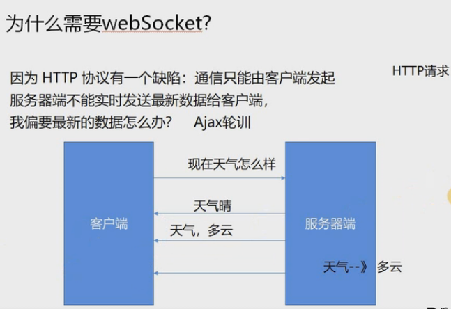

# API -应用程序接口

已经封装好的 函数、 方法、 属性、 事件，直接拿来用就好了

## requestAnimationFrame

我们先来看没有使用css3的以前的动画

```html
<div class="box" style="position:absolute;width:100px;height:100px;background-color:#f60;left:0;top:0;"></div>
<script>
	var box = document.getElementByClassName('box')[0];
    var timer = null;
    function move() {
        /*
        timer = setInterval(function () {
            box.style.left = box.offsetLeft + 10 + 'px';
            if (box.offsetLeft > 600) {
                clearInterval(timer);
            }
        }, 10)
        */
        timer = setTimeout(function () {
            box.style.left = box.offsetLeft + 10 + 'px';
            if (box.offsetLeft < 600) {
                move();
            }else {
                clearTimeout(timer);
            }
        }, 10)
    }
    move();
</script>
```

再对比requestAnimationFrame（屏幕刷新1秒60次）

```js
function run() {
	timer = requestAnimationFrame(function () {
    	box.style.left = box.offsetLeft + 10 + 'px';
        /*
        if (box.offsetLeft < 600) {
            move();
        }else {
        	cancelAnimationFrame(timer);
        }
        */
        var timer2 = requestAnimationFrame(run);
        if (box.offsetLeft > 600) {
            cancelAnimationFrame(timer2);
        }
    })
    // 这里的时间是16.666...
}
```

好处：不会丢帧，根据屏幕刷新频率来执行的

IE8及以下不支持

所以需要兼容性封装

```js
window.requestAnimationFrame = (function () {
	return window.requestAnimationFrame ||
        window.webkitRequestAnimationFrame ||
        window.mozRequestAnimationFrame ||
        function (callback) {
        window.setTimeout(callback, 1000 / 60)
    }
}())
```


##  客户端储存

 #### storage(5M左右)

- `localStorage` : 永久存储

  存储方式：

  ```js
  localStorage.name = 'hsz'
  localStorage.info = JSON.stringify({name:'hsz',company:'duyi'})
  ```

  （json转为字符串格式）

  

  读取方式：

  ```js
  localStorage.name
  JSON.parse(localStorage.info) ; 
  ```

  转为JSON格式

  

- `sessionStorage` : 零时存储(切换新窗口就被删除)

- 提供了基础的API

  `setItem(name, vla)`设置属性值

  `getItem(name)` 获取属性值

  `removeItem(name)` 移除属性

  `clear() `清除属性

#### cookie(4k左右)

存储信息到用户设备上

`navigator.cookieEnabled` : 检测是否启用了cookie

```js
// 封装cookie函数
function cookie(name) {
    var name = name + "=";
    var ca = document.cookie.split(';');
    for (var i = 0; i < ca.length; i++) {
        var c = ca[i];
        while(c.charAt(0)) == '') c = c.substring(1);
        if(c.indexOf(name) != -1) return c.substring(name.length, c.length);
    }
    return "";
}
```


- 设置cookie值/存储期限：

  ```js
  document.cookie="name=hsz;max-age=1000"
  // 单位：s
  ```

  每次只能设置一个值，因为浏览器会认为键值对是这个cookie的属性

  

- 获得cookie值：

  ```js
  document.cookie
  ```

- `expires`当前时间加上保存时间

  ```js
  var timestamp = (new Date().getTime() + 10000);
  var expires = new Date(timestamp).toGMTString();
  document.cookie = "name=hsz;expires= "+expires;
  ```

- domain

  *domain*表示的是*cookie*所在的域,默认为请求的地址

- path(路径)、

  同一个站点下无法读取其他页面的cookie

  ```js
  document.cookie = "name=value;path=path"
  ```

  （1）.path用来设置cookie生效的目录，是一个绝对路径。

  （2）.只有path目录和其子目录下的页面可以访问当前cookie。

  （3）.如果不显式设置path，那么默认就是当前页面所在的目录。

## 历史记录

- `history.back()`
- `history.forward()`
- `history.go(n)`

html5新增的方法

通过修改`hash`和`hashchange`事件来实现历史记录管理

1. `pushState`

   `history.pushState(state, title, url);` 添加一条历史记录, 更新url路径，但是不会更新页面

2. `replaceState`

   `history.replaceState(state, title, url); `替换当前历史记录

参数：

state：一个与指定网址相关的状态对象，popstate事件触发时，该对象会传入回调函数中。如果不需要这个对象，此处可填null

title：新页面的标题，但是所有浏览器目前都忽略这个值，因此可以填null

url：新的网址，必须与当前页面在同一个域。浏览器的地址栏将显示这个网址

- history上新增的事件

  1、[popstate事件](./demo3.html)

  [*历史记录发生改变时触发*](https://z826526354.github.io/myProject/H5/demo3.html)

  调用`history.pushState()`或者`history.replaceState()`不会触发popstate事件

  2、hashchange事件

  当页面hash值改变的时候触发，常用于构建单页面应用

## [worker](https://z826526354.github.io/myProject/H5/demo4.html)

```js
var worker = new Worker('worker.js');
```

- worker文件必须和主文件满足同源策略

- worker主要处理大量的计算

### worker和主线程之间的通信

- postMessage(n)方法

-  message事件

### 结束worker

- close() 在worker作用域中调用(worker.js) —— 相当于工人辞职
- terminate() 在worker对象上调用 ( 主进程的worker对象上 worker.terminate ) —— 相当于老板炒鱿鱼

### 其他特性

- `improtScripts(./math1.js, './math2.js')`

  worker只是window上的子集，只能实现部分功能，不能获取到window，document，所以不要引入jquery zepto。当然想用的话可以传给子文件

  可以引入一些计算类的库

- 作用域 `WorkerGlobalScope`

  可以继续生成worker对象（FireFox可以chrome暂时不支持）

  `navigator`

  `XMLHttpRequest`

  `setTimeout / serInterval`

- 可以用ajax轮循监听数据变化

### worker的缺点

- 受同源策略限制

- 受到主线程DOM的限制

- worker线程和主线程不在同一个上下文环境，它不能直接通信，必须通过消息完成

- 脚本限制：worker线程不能执行`alert`或者`confirm`， 但是可以使用`XMLHttpRequest` 对象发出的ajax请求

- 文件限制：worker线程无法读取本地文件，既不能打开本机的文件系统，他所加载的脚本必须来自网络

  

## fileReader

读取文件

### fileReader的使用方法

`abort() `终止读取

`readAsBinaryString(file)`将文件读取为二进制编码

`readAsDataURL(file)` 将文件读取为DataURL编码

`readAsText(file, [encoding])` 将文件读取为文本

`readAsArrayBuffer(file)` 将文件读取为ArrayBuffer

[文件上传功能](https://z826526354.github.io/myProject/H5/file.html)：

```html
<input type="file">

<div class="progress">
    <div class="bar"></div>
</div>
<span class="text"></span>
<button class="abort">停止读取</button>

// 虽然可以读取文件但是没有预览功能
<script>
	var inp = document.getElementsByTagName('input')[0];
    var img = document.getElementsByTagName('img')[0];
    var text = document.getElementsByClassName('text')[0];
    var bar = document.getElementsByClassName('bar')[0];
    var btn = document.getElementsByClassName('abort')[0];
    var reader = new FileReader();
    inp.onchange = function () {
        console.log(inp.files);
        reader.readAsDataURL(inp.files[0])
        bar.style.width = '0px';
    }
    reader.onload = function (e) {
        img.src = this.result;
    }
    reader.onloadstart = function (e) {
        console.log(this == e.target);// true
        console.log('start', e, this.result);
    }
    reader.onprogress = function (e) {
        // console.log('progress', e.loaded / e.total * 100%);
        var precent = e.loaded / e.total * 100;
        var width = Math.round(300 * precent / 100);
        bar.style.width = width + 'px';
        text.innerHTML = Math.round(precent) + '%';
    }
    reader.onload = function (e) {
        console.log('success', e);
        img.src = this.result;
    }
    reader.onloadend = function (e) {
        console.log('end', e)
    }
    btn.onclick = function () {
        reader.abort();
    }
</script>
```

#### fileReader读取文件事件

- onloadstart 读取时开始触发

```js
reader.onloadstart = function (e) {console.log('start', e, this.result)}
```

- onprogress 读取中
- onloadend 读取完成时触发， 无论成功失败
- onload 文件读取成功时触发
- onabort 中断时触发
- onerror 出错时触发

#### file上的slice方法

- 当我们上传的文件比较大时使用
- `file.slice(起始字节, 终止字节)`

### [fileReader可实现的功能](https://z826526354.github.io/myProject/H5/filereader.html)


## websocker

```js
var sorket = new WebSocket('ws://echo.websocket.org/');

socket.onopen = function () { // 建立socket连接时触发这个事件
    socket.send('hello');// 方法使用传输数据
}

socket.onmessage = function (e) {
    // 客户端从服务器接收数据时触发
    console.log('message')
    console.log(e);
    console.log(e.data)
    socket.close(); // 终止现有的任何链接
}

socket.onclose = function (e) {
    // 连接被关闭时触发
    console.log(e)
    console.log('close')
}

socket.onerror = function () {
    // 连接发生错误时触发
    console.log('error')
}
```

```js
socket.readyState
/*
0 : 连接尚未建立
1 : 表示已连接，可以进行通信
2 : 表示连接正在进行关闭
3 : 表示连接已经关闭或者连接不能打开
*/
```

```js
socket.bufferedAmount
/*
只读属性
bufferedAmound已被send()放入，正在队列中等待传输，但还没有发出UTF-8的文本字节数
*/
```


#### 报文头字段含义

- Connection: 必须设置Upgrade,表示客户端希望连接升级。

- Upgrade:      字段必须设置Websocket,表示希望升级到Websocket协议。

- Sec- WebSocket- Key:    是随机的字符串，服务器端会用这些数据来构造出一个SHA-1的信息摘要。把"Sec-WebSocket-Key 加上一个特殊字符串“258EAFA5-E914-47DA-95CA-
  C5ABODC85B11"，然后计算SHA-1摘要，之后进行BASE-64编码，将结果做为"Sec-
  WebSocket-Accept"头的值， 返回给客户端。如此操作，可以尽量避免普通HTTP请求被误认为Websocket协议。

- Sec-WebSocket-Version:    表示支持的Websocket版本。RFC6455 要求使用的版本是13,之前草案的版本均应当弃用。

- Sec-WebSocket-Protocal:    是一个用户定义的字符串，用来区分同URL下，不同的服务所需要的协议。

- Origin:     字段是可选的，通常用来表示在浏览器中发起此Websocket连接所在的页面，类似于Referer。但是，与Referer 不同的是，Origin 只包含了协议和主机名称。

其他些定义在HTTP协议中的字段，如Cookie等，也可以在Websocket中使用。


#### Websocket特点

  (1)建立在TCP协议之上，服务器端的实现比较容易。

  (2)与HTTP协议有着良好的兼容性。默认端口也是80和443,并且握手阶段采用HTTP协议，因此握手时不容易屏蔽，能通过各种HTTP代理服务器。

  (3)数据格式比较轻量，性能开销小，通信高效。

  (4)可以发送文本，也可以发送进制数据。

  (5)没有同源限制，客户端可以与任意服务器通信。

  (6)协议标识符为ws (如果加密为wss)服务器网址就是url

  (7)不受同源策略的限制

 

#### 为什么需要webSocket?

因为HTTP协议有一个缺陷:

通信只能由客户端发起服务器端不能实时发送最新数据给客户端，我偏要最新的数据怎么办? 



#### Websocket优点

- 客户端与服务器都可以主动传数据给对方

- 不用频繁创建和销毁TCP请求，减少网络宽带资源的占用，同时也节省服务器资源

  

# 移动端事件处理

## 地理位置信息（geolocation）

window.navigator.geolocation

#### 1、`getCurrentPosition(s, e, op)`: 获取当前的位置信息

- success回调（必须）

- error回调

- options参数

  `enableHighAccuracy`是否需要高精度位置默认false

  `timeout`单位ms请求超时时间默认infinity

  `maximumAge`单位ms, watchPosition方法则不停地取用户的地理位置信息，不停地更新用户的位置信息。位置信息过期时间设置为0就无条件获取新的地理位置信息默认0

  https://dev.w3.org/geo/api/spec-source.html#position_options_interface

  ```js
  var options = {
  	timeout : 1000,
      enableHighAccuracy : true,
  }
  ```

  

- 需要翻墙

  ```js
  // 特别注意，chrome需要在连上vpn的时候才能获取到
  var success = function (pos) {
  	console.log(pos)
  }
  // 只传一个参数
  window.navigator.geolocation.getCurrentPosition(success)
  ```

##### Geoposition对象属性

- latitude纬度

- longitude经度

- altitude海拔

- accuracy定位精准度，单位m

- altitudeAccuracy海拔精准度，单位mheading方向  

- speed速度
  https://dev.w3.org/geo/api/spec-source.html#coordinates_interface


#### 2、`watchPosition(s, e, op)`：监视位置变化，参数同上

```js
var watcher = window.navigator.geolocation.watchPosition(success, error, option)
```

在设备地理位置发生改变时自动被调用


#### 3、`clearWatch()` : 清除位置监视

```js
window.navigator.geolocation.clearWatch(watcher)
```


### [devicemotion事件所包含的属性（只读）](https://z826526354.github.io/myProject/H5/jiasudu.html)

- accelerationIncludingGravity : 重力加速度（包括重心引力，z轴方向加了9.8，在x,y方向上的值两者相同）
- acceleration : 加速度（不包含重力加速度，需要陀螺仪支持）
- rotationRate（alpha，bete，gamma）: 旋转速率
- interval：获取时间间隔

```js
// 监听加速度变化
window.addEventListener('devicemotion', function (event) {
xonsole.log(evevt)
})
```


### [deviceorientation监听设备在方向上的变化](https://z826526354.github.io/myProject/H5/zhiNanZhen.html)

```js
window.addEventListener('deviceorientation', function (event) {
    console.log(event)
})
```

##### 事件源对象属性

1.`alpha`表示设备沿z轴上的旋转角度，范围为0~360正北0

2.`beta`表示设备在x轴上的旋转角度，范围为-1 80~ 180。它描述的是设备由前向后旋转的情况。

3.`gamma`表示设备在y轴上的旋转角度，范围为-90~90。它描述的是设备由左向右旋转的情况。

4、`webkitCompassHeading`:与正北方向的角度差值。正北为0度，正东为90度，正南为1 80度，正西为270度。因为0度是正北，所以叫指北针。*ios特有*

5、`webkitCompassAccuracy`: 指北针的精确度，表示偏差为正负多少度。-般是10。


