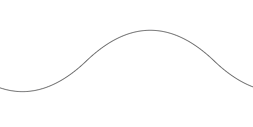
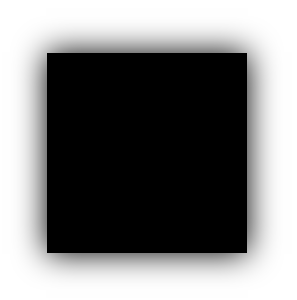
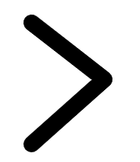

## Canvas

定义一个canvas的画布大小必须要在行间样式上定义，我们在`<style></style>`里面定义的只是canvas的一个科室范围并不是画布大小

```html
<!DOCTYPE html>
<html lang="en">
<head>
	<meta charset="UTF-8">
	<title>Document</title>
	<style>
		
		#can {
			/*定义canvas的可视范围*/
			width: 500px;
			height: 300px;
			border: 1px solid black;
		}
	</style>
</head>
<body>
	
	<canvas id="can" width="500px" height="300px"></canvas>
	<script>
		var can = document.getElementById('can');
		var ctx = canvas.getContext("2d");
		// 在canvas上建立2d坐标系
		ctx.beginPath(); // 开始之前建议加上这个
		ctx.moveTo(100, 100); // 起点（落笔点）
		ctx.lineTo(200, 100); // 到200， 100坐标点
        ctx.lineWidth = 10; // 线宽（无论写在哪都相当于写在最前面）
        ctx.closePath(); // 闭合（针对一笔来说的）
        ctx.fill();  // 填充
		ctx.stroke(); // 将画笔抬起来（结束，之后才开始渲染页面）
        
        ctx.beginPath(); // 重新开启一个路径（重新落笔）
        ctx.lineWidth = 5; // 此时画笔粗细就可以改为5了
		ctx.stroke();

	</script>
</body>
</html>
```

#### 矩形

```js
var can = document.getElementById('can');
var ctx = canvas.getContext("2d");

ctx.rect(100, 100, 150, 100);
// 起点坐标X，起点坐标Y，宽度，高度
ctx.stroke();

// 可以简写为这样
ctx.strokeRect(100, 100, 200, 100);
// 填充
ctx.fillRect(100, 100, 200, 100);

ctx.clearRect(0, 0, 300, 300);
//橡皮檫（起点X，起点Y，宽， 高）
```

```js
var can = document.getElementById('can');
var ctx = canvas.getContext("2d");
ctx.moveTo(100, 100);
ctx.arc(100, 100, 50, 0, Math.PI / 4, 1);
// （圆心起点X， 圆心起点Y，半径，起始弧度，终止弧度，[顺]逆时针） 
// 最后的 0 代表顺时针旋转，如果是 1 代表逆时针旋转； 
ctx.closePath();
ctx.stroke();
```

#### 圆角矩形

```js
var can = document.getElementById('can');
var ctx = canvas.getContext("2d"); 
ctx.moveTo(100, 110); 
// 设置110是因为要让出圆角的位置
ctx.arcTo(100, 200, 200, 200, 10);
// B(x, y), C(x, y)[只是提供一个方向], 圆角大小
ctx.arcTo(200, 200, 200, 100, 10);
ctx.arcTo(200, 100, 100, 100, 10);
ctx.arcTo(100, 100, 100, 200, 10);
ctx.stroke();
```

#### 贝塞尔曲线

二次

```js
var can = document.getElementById('can');
var ctx = can.getContext("2d");

ctx.beginPath()
ctx.moveTo(100, 100);
ctx.quadraticCurveTo(200, 200, 300, 100)
ctx.stroke();
```

三次

````js
var can = document.getElementById('can');
var ctx = can.getContext("2d");

ctx.beginPath()
ctx.moveTo(100, 100);
ctx.bezierCurveTo(200, 200, 300, 100, 400, 200)
ctx.stroke();
````

#### 小波浪

```js
var can = document.getElementById('can');
var ctx = can.getContext("2d");
// 在canvas上建立2d坐标系
var width = 500;
var height = 300;
var offset = 0;
var num = 0;
setInterval(() => {
    ctx.clearRect(0, 0, 500, 300);
    ctx.beginPath();

    ctx.moveTo(0 + offset - 500, height / 2);
    ctx.quadraticCurveTo(width / 4 + offset - 500, height / 2 + Math.sin(num) * 120, width / 2 + offset - 500, height / 2);

    ctx.quadraticCurveTo(width / 4 * 3 + offset - 500, height / 2 - Math.sin(num) * 120, width + offset - 500, height / 2);

    ctx.moveTo(0 + offset, height / 2);
    ctx.quadraticCurveTo(width / 4 + offset, height / 2 + Math.sin(num) * 120, width / 2 + offset, height / 2);

    ctx.quadraticCurveTo(width / 4 * 3 + offset, height / 2 - Math.sin(num) * 120, width + offset, height / 2);
    ctx.stroke();
    offset += 5;
    offset %= 500;
    num += 0.01;
}, 1000 / 30)
```

[示例演示](https://github.com/z826526354/myProject/blob/master/H5/demo (2).html)：  



#### 旋转、缩放

```js
ctx.rotate(Math.PI / 6);
// 以ctx坐标系为原点旋转（全局的）

ctx.translate(100, 100)
// 平移坐标系原点到100， 100（全局的）

ctx.scale(2, 2);
// 整个画布横纵坐标都放大2倍
```

#### 保存、还原

```js
ctx.save();
// 保存这个状态（一般用于要旋转或者改变原点坐标之前）

ctx.restore();
// 还原上次保存点的状态
```

#### 填充

```js
var img = new Image();
img.src = "./xxx.jpg"; // src异步加载
img..onload = function () {
    ctx.beginPath();
    var bg = ctx.createPattern(img, "no-repeat");
    // 创建纹理
    // ctx.fillStyle = "orange"; // 填充颜色
    ctx.translate(100, 100);
    ctx.fillStyle = bg; // 从坐标系原点开始填充
    ctx.fillRect(0, 0, 200, 100);
}
```

#### 线性渐变

```js
ctx.beginPath()
var bg = ctx.createLinearGradient(0, 0, 500, 500);
bg.addColorStop(0.1, 'red');
bg.addColorStop(0.5, 'green');
bg.addColorStop(1, 'yellow');
ctx.fillStyle = bg; 
// 渐变点也是从画布原点开始的
ctx.fillRect(0, 0, 500, 500)
```

#### 辐射渐变

```js
var bg = ctx.createRadialGradient(100, 100, 0, 100, 100, 100);
bg.addColorStop(0.1, 'red');
bg.addColorStop(0.5, 'green');
bg.addColorStop(1, 'yellow');
ctx.fillStyle = bg;
ctx.fillRect(0, 0, 200, 200)
```

#### 阴影

```js
ctx.beginPath();
ctx.shadowColor = "black";
ctx.shadowBlur = 30; // 扩散值
ctx.shadowOffsetX = 15; // x轴的阴影偏移量
ctx.strokeRect(100, 100, 200, 200);  
```



#### 绘制文字

```js
ctx.beginPath();

ctx.font = '30px Arail'
ctx.strokeText('hsz', 200, 200); // 文字描边（空心）
ctx.fillText('hahah', 200, 400); // 文字填充（实心）
```

#### 线两端样式

```js
ctx.lineCap = 'butt'; // 默认butt，square两端加上小方块，round两端加小半圆
```

```js
ctx.beginPath();
ctx.lineWidth = 20;
ctx.lineCap = 'round'
ctx.moveTo(110, 30);
ctx.lineTo(200, 100);
ctx.lineTo(110, 180);
ctx.lineJoin = "round";
// 默认miter 但是角度很小的时候会呈现被砍断状态"bevel"
// 当为miter时，可以限制尖尖（miterLimit=xx 属性）
ctx.stroke();
```



#### 获取图片转换为像素点

```js
var img = new Image();
img.src = './xx.jpg';
img.onload = function () {
    ctx.drawImage(img, 100, 100, 400, 400, 100, 100, 300, 300);
    var data = oCanvas.toDataURL();
    console.log(data);
    // 受同源策略的限制（要开启服务器）
    var info = ctx.getImageData(0, 0, 500, 500);// 获取像素点信息
    console.log(info);
}
```

