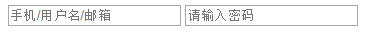
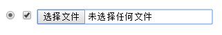
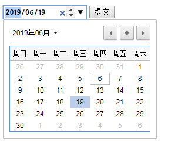
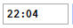
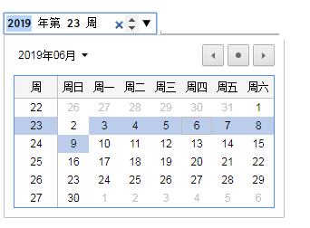
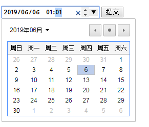
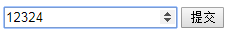
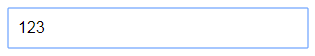

## 属性篇

- placeholder

```html
<input placeholder="用户名/手机/邮箱"></input>
<input type="password" placeholder="请输入密码">
```



- radio、check、file

```html
<input type="radio">
<input type="checkbox">
<input type="file">
```



- Calendar类( 需要form表单 )

  

```html
<form>
    <input type="date">
    <input type="submit">
</form>
<!-- 兼容性不好，目前只有Chrom支持，所以不常用 -->
```




```html
<form>
    <input type="time">
    <input type="week">
    <input type="datetime-local">
</form>
<!-- 兼容性不好，目前只有Chrom支持，所以不常用 -->
```

time

week

datetime-local

```html
<input type="number"></input>
<!-- 兼容性不好, Safari, IE 不支持 -->

<input type="email"></input>
<!-- 输入必须带 @ 兼容性不好, Safari, IE不支持， 谷歌火狐支持 -->

<input type="color"></input>
<!-- 颜色选择器 兼容性不好, Safari, IE不支持 谷歌支持-->

<input type="range" min="1" max="100" name=range></input>
<!-- 兼容性不好, 火狐, IE不支持 谷歌火狐支持 -->

<input type="search"></input>
<!-- 搜索记忆功能 兼容性不好, Safari支持一点, IE不支持 谷歌火狐支持 -->

<input type="url"></input>
<!-- 必须填完整网址 兼容性不好, Safari, IE不支持 谷歌火狐支持 -->
```

只能输入数字

range 

- contenteditable

  将文本内容转为可写，兼容性良好，并且可以继承，父级有子集也会有。

  但是子集也可以设置为false（不可写），虽然内部不可以编辑，但是在父级内部，自己外部， 依然是可以编辑的

```html
<div contenteditable="true">123</div>
```



- Draggable  ( 可拖拽的 )

  a、img标签默认可拖拽

```html
<div class="able" draggable="true"></div>
<!-- 兼容性不好  谷歌Safari支持 
拖拽的生命周期（拖拽的组成）
1. 拖拽开始，拖拽进行中，拖拽结束
2. 被拖拽的物体，目标区域
-->
<script>
    var oDragDiv = document.getElementsByClassName('able')[0];
    var beginX = 0;
    var beginY = 0;
    oDragDiv.ondragstart = function (e) {
        // 按下物体的瞬间是不会触发ondragstart事件的，移动开始的瞬间才开始触发
        beginX = e.clientX;
        beginY = e.clientY;
    }
    oDragDiv.ondrag = function (e) {
        // 移动事件
    }
    oDragDiv.ondragend = function (e) {
        // 结束事件
        var X = e.clientX - beginX;
        var Y = e.clientY - beginY;
        oDragDiv.style.left = oDragDiv.offsetLeft + X + 'px';
        oDragDiv.style.top = oDragDiv.offsetTop + Y + 'px';
    }
    // offsetLeft 获取的是相对于父对象的左边距
    // pageX、pageY跟clientX和clientY类似，是相对于浏览器文档的坐标；
</script>
```


```html
<head>
	<meta charset="UTF-8">
	<title>Document</title>
	<style>
		.abled{
			margin: 50px 0px 0px 100px;
			width: 140px;
			height: 170px;
			border: 2px solid black;
			border-radius: 3px;
			display: inline-block;
		}
		ul{
			padding: 0;
		}
		li{
			list-style: none;
			width: 100px;
			height: 40px;
			margin: 10px auto;
			background-color: #2FBDDF;
			border-radius: 5px;
			transition: all 0.3s;

		}
		li:hover{
			
			box-shadow: 0px 0px 10px rgba(0, 0, 0, 0.5);
		}
		.target{
			margin-left: 100px;
			width: 140px;
			height: 170px;
			border: 2px solid black;
			border-radius: 3px;
			display: inline-block;
		}
	</style>
</head>
<body>
	<div class="abled">
		<ul>
			<li></li>
			<li></li>
			<li></li>
		</ul>
	</div>
	<div class="target" draggable="true"></div>
</body>
<!-- 
1. 所有的标签元素，当拖拽结束时，默认事件是回到原处
2. 事件是由行为触发的，一个行为可以不止触发一个事件
3. ondragover ==> 回到原处 ==> 执行drop事件
   A->B(阻止默认事件)->c（才可以执行）
-->
<script>
    var dragDom;
    var liList = document.getElementsByTagName('li');

    for (var i = 0; i < liList.length; i++) {
        liList[i].setAttribute('draggable', true);
        liList[i].ondragstart = function (e) {
            dragDom = e.target;
            e.dataTransfer.effectAllowed = "move";
            // 设置拖拽时的鼠标样式 只能在ondragstart里面使用 不常用
        }
    }
    var oTarget = document.getElementsByClassName('target')[0];
    oTarget.ondragover = function (e) {
        e.preventDefault();
    }
    oTarget.ondrop = function (e) {
        oTarget.appendChild(dragDom);
        dragDom = null;
    }
    var abled = document.getElementsByClassName('abled')[0];
    abled.ondragover = function (e) {
        e.preventDefault();
    }
    abled.ondrop = function (e) {
        abled.appendChild(dragDom);
        dragDom = null;
        e.dataTransfer.dropEffect = "copy";
        // 设置拖拽放下时的鼠标样式 只能在ondrop里面使用  不常用
    }
    // 释放目标时触发的事件:
	// ondragenter - 当被鼠标拖动的对象进入其容器范围内时触发此事件
	// ondragover - 当某被拖动的对象在另一对象容器范围内拖动时触发此事件
	// ondragleave - 当被鼠标拖动的对象离开其容器范围内时触发此事件
	// ondrop - 在一个拖动过程中，释放鼠标键时触发此事件
</script>
```


