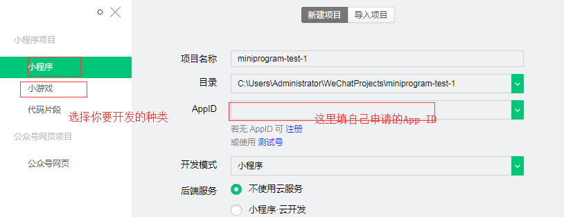
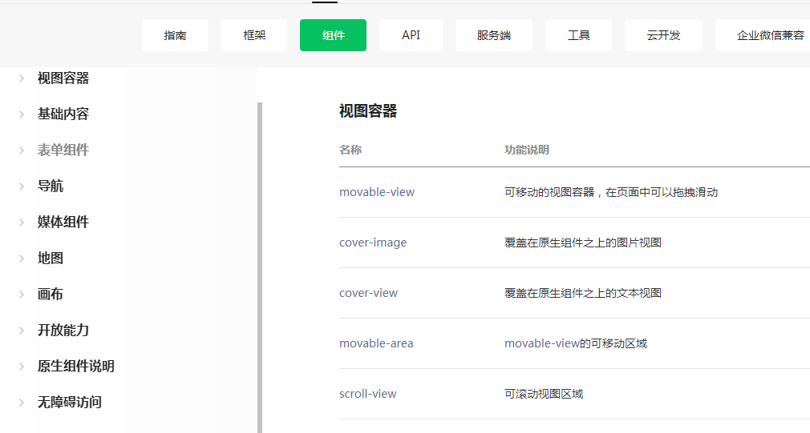

## 微信小程序

首先下载 **[微信小程序开发工具](https://developers.weixin.qq.com/miniprogram/dev/devtools/download.html)**

然后注册自己的[小程序账号](https://mp.weixin.qq.com/)

找到自己的小程序id



然后就可以进入开发页面了


- #### 小程序简介（Hybrid）

  1）限制大小在1M以内

  2）相比传统App 不需要大流量下载

  3）只能在微信里面使用（这也是不能火起来的原因，自己的用户全都被绑定在微信里面了）

  4）很多权限没有开放给开发者（至少目前）

  5）语言Object C （ios） + html  受限制于UIWebView

- #### 传统App简介（Native）

  1）大小不限制，甚至大多数都很大，占用手机内存多

  2）开发者权限很大，可以调用很多底层接口

  3）性能好，直接请求cpu资源

  4）实现一个应用App的话要写两套iOS（object C）和Android（java）

- #### 网页App （webApp）

  1）性能比不上上面俩大哥

  2）底层接口无法调用

  3）但是更新无需下载

  3）无需安装，直接浏览器访问

#### 小程序适合做哪些应用？

- 简单，用完即走
- 简单低频
- 性能要求不高

（投票，打车，评分，新闻）

#### 下面开始程序之旅


小程序界面将控制台，代码区，以及试视图区放到了一块以便我们能够高开发

每当我们保存一次，就会自动刷新一次，就像是自带webpak 的watch功能一样

其次左边的文件栏app.json 就是配置我们的子页面，以及一些全局属性的

```json
{
  "pages": [
      // 设置页面路径：这里是添加页面的，对应上面的welcome文件夹
    "projects/index/welcome"
      // 只要写了这一行，文件夹内就会自动生成相对应名称的js，wxml，wxss，json四个文件
  ],
    // 配置视图窗口
  "window": {
    "navigationBarBackgroundColor": "#3ba5b0", // 头部导航栏背景颜色
    "navigationBarTitleText": "wechat", // 配置头部内容
    "navigationBarTextStyle": "black", // 配置头部导航栏字体颜色（黑和白）
    "backgroundColor": "#eeeeee",   // 内容区背景颜色也，可以在welcome里面设置page
    "backgroundTextStyle": "light", // 背景文本风格，这个不影响，一般不用调
    "enablePullDownRefresh": false // 是否下拉刷新
  }
},
```

### tabBar

如果小程序是一个多 tab 应用（客户端窗口的底部或顶部有 tab 栏可以切换页面），可以通过 tabBar 配置项指定 tab 栏的表现，以及 tab 切换时显示的对应页面

```js
// 承接上面的代码块
// 至少需要两个tab选项list
"tabBar": {
    "list": [{
      "pagePath": "pagePath",// 页面路径，必须在 pages 中先定义
        
      "text": "text", // tab 上按钮文字
        
      "iconPath": "iconPath", 
        // 图片路径，icon 大小限制为 40kb，建议尺寸为 81px * 81px，不支持网络图片。
      
        "selectedIconPath": "selectedIconPath"
        // 选中时的图片路径，icon 大小限制为 40kb，建议尺寸
        // 为 81px * 81px，不支持网络图片。当 position 为 top 时，不显示 icon。
    },{
      "pagePath": "pagePath",
      "text": "text",
      "iconPath": "iconPath",
      "selectedIconPath": "selectedIconPath"
    }]
  }

text	string	是	
iconPath	string	否	
当 position 为 top 时，不显示 icon。
selectedIconPath	string	否	
```

[其他的框架组件链接](https://developers.weixin.qq.com/miniprogram/dev/reference/configuration/app.html)

#### 像素问题

px（物理像素） 

pt（逻辑像素）

不同的设备，DPI（PPI）不同的

在小程序中rpx是已经经过内部计算返回给我们的单位

具体，等我有空弄出来

#### 标签

在小程序中 `<view></view>`就相当于`<div></div>`

轮播图 :  不像js一样需要我们封装，但是在这里只要引入标签即可

```html
<swiper autoplay interval="1000" circular="true">
	<swiper-item>content1</swiper-item>
	<swiper-item>content1</swiper-item>
    <swiper-item>content1</swiper-item>
</swiper>
<icon type="success"/>
```

` autoplay interval="1000" circular="true"`自动播放 切换时间为1000毫秒,并且循环播放

`<icon type="success"/>`设置图标——通过改变type改变图标样式

官网还提供了很多高级组件




后续更新中