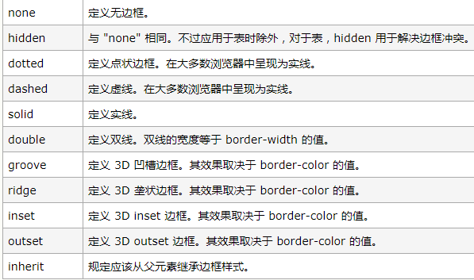

## CSS层叠样式表(cascating style sheet)

#### 选择器

选择器类型			    权重

important				  infinity

行间样式					1000

id								100

class|属性|伪类	   10

标签|伪元素			  1

通配符						0


父子选择器    		div span

直接子元素选择器 div>span

并列选择器			div.demo

分组选择器			div, span{}


`margin: 0 auto;`    自适应

`background-color:`背景颜色

`background-repeat: no repeat / repeat-x / repeat-y;`

背景重复			不重复	x方向重复	y方向重复

`background-size:`也可以是百分比

| cover   | 把背景图像扩展至足够大，以使背景图像完全覆盖背景区域。背景图像的某些部分也许无法显示在背景定位区域中。 |
| ------- | ------------------------------------------------------------ |
| contain | 把图像图像扩展至最大尺寸，以使其宽度和高度完全适应内容区域。 |

`background-position : x  y ;`——背景图片的定位

x-x方向

y-y方向


- border:外部框

  ```css
  // 三角形制作
  div{
      border: 35px solid transparent;
  	border-left: 35px solid 
  }
  ```

  



`outline:` 外部轮廓线

`font-size:` 文字高度（默认16px）

1em = 1font-size

`line-height:` 单行文本高度

`text-indent: x em;` 缩进x文本的单位

`text-decoration: line-throng / none / underline / overline;`

中划线	无		下划线	上划线

`font-family: arial;`( 字体种类 )

`font-style: italic / oblique / normal;`

字体样式	斜体	倾斜		标准（前面两个差不多）


`text-align : center;` //文本居中

`vertical-align: middle;` //文本类对齐线

一旦文本类或者文本类块级元素内有字了，设置了`vertical-align: middle;`

的文字就会相对那个元素内的字体对齐 

单行文本高度 = 容器高度——普遍的居中方式 


`cursor: pointer;` // 鼠标在某元素上锁呈现的样式为小手


小知识补充

rgb（0， 0， 0）

分别代表red， green， blue

rgba（0， 0， 0， 0.5）

分别代表red， green， blue， 透明度


box-shadow: 5px 5px 5px rgba(0, 0, 0, 0.3);


盒模型= margin + padding + border + element / content

块级元素 : div p ul li ol form（独占一行，可以通过css改变宽高）

行级元素 : span strong em a del（内容决定元素所占位置，不可通过css改变宽高）

行级块元素 : img（两者优点的结合）

padding :  上         右        下      左；

  :  上        左右      下

  :  上下     左右 

left / top / right / bottom / z-index——只适用于有定位的元素

position:absolute / relative / fixed;

定位		 

absolute——脱离原来位置相对于有定位的父级定位，没有则相对于窗口定位

relative——相对于自身初始位置定位

fixed—— 相对于窗口定位


编程思想——先写html / 先写css

##### 行级元素只能嵌套行级元素，块级元素可以嵌套任何元素


##### 关于margin塌陷问题

垂直之间塌陷的原则是以两盒子最大的外边距为准

解决办法: 触发盒子的bfc

1. position: absolute;
2. display: inline-block;

3. float: left / right;

4. overflow: hidden;

(原理: 改变渲染规则)


关于浮动流: 文本以及文本类块级元素可以看到浮动流

清除浮动 : 利用伪元素、

```css
span::after{
	content: "";/*——让伪元素生效*/
	clear: both;/*——清除浮动*/
	display: block;/*——让clear生效*/
}
```

凡是设置了position和float，元素会自动变成inline-block

伪元素:

`::after`

`::before`


- 单行文本溢出打点:

```css
div{
   	white-space: nowrap;
	overflow-hidden;
	text-overflow: ellipsis;
}
```


- 淘宝logo制作方法

```css
div{
    width: 0;
	padding-top: 90px;
	overflow: hidden;
}
```

- 标准盒模型变IE盒模型

```css
div{
    box-sizing: border-box;
}
```


#### 描述一下盒模型

margin：设置一个元素所有外边距的宽度

border： 围绕元素内容和内边距的一条或多条线

padding： 属性定义元素的内边距。padding 属性接受长度值或百分比值，但不允许使用负值

content：内容区

**W3C 盒子模型的范围包括 margin、border、padding、content，并且 content 部分不包含其他部分。**

**IE 盒子模型的 content 部分包含了 border 和 pading**


### 简述display常用的的属性

| 值           | 描述                                                 |
| :----------- | ---------------------------------------------------- |
| none         | 此元素不会被显示。                                   |
| block        | 此元素将显示为块级元素，此元素前后会带有换行符。     |
| inline       | 默认。此元素会被显示为内联元素，元素前后没有换行符。 |
| inline-block | 行内块元素。（CSS2.1 新增的值）                      |
| list-item    | 此元素会作为列表显示。                               |
| run-in       | 此元素会根据上下文作为块级元素或内联元素显示。       |
| flex         | 此元素将作为css3弹性盒模型                           |


### CSS3可用的伪类有哪些？

1. **:first-child**选择某个元素的第一个子元素；

2. **:last-child**选择某个元素的最后一个子元素；

3.  **:nth-child()**选择某个元素的一个或多个特定的子元素；

4.  **:nth-last-child()**选择某个元素的一个或多个特定的子元素，从这个元素的最后一个子元素开始算；

5.  **:nth-of-type()**选择指定的元素；

6.  **:nth-last-of-type()**选择指定的元素，从元素的最后一个开始计算；

7. **:first-of-type**选择一个上级元素下的第一个同类子元素；

8.  **:last-of-type**选择一个上级元素的最后一个同类子元素；

9.  **:only-child**选择的元素是它的父元素的唯一一个了元素；

10.  **:only-of-type**选择一个元素是它的上级元素的唯一一个相同类型的子元素；

11.  **:empty**选择的元素里面没有任何内容。


### position有哪些值， 有什么区别？

| 值       | 描述                                                         |
| :------- | :----------------------------------------------------------- |
| absolute | 生成绝对定位的元素，相对于 static 定位以外的第一个父元素进行定位。 |
| fixed    | 生成绝对定位的元素，相对于浏览器窗口进行定位。               |
| relative | 生成相对定位的元素，相对于其正常位置进行定位。               |
| static   | 默认值。没有定位，元素出现在正常的流中（忽略 top, bottom, left, right 或者 z-index 声明）。 |
| inherit  | 规定应该从父元素继承 position 属性的值。                     |

