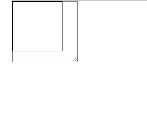
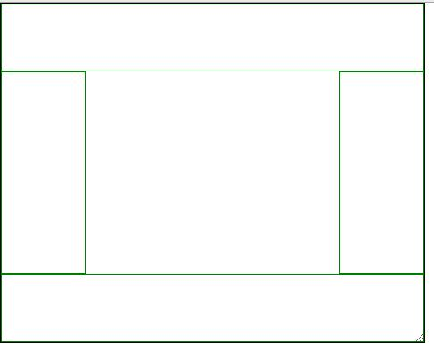

## [CSS3](./css3-brief.md)

**触发浏览器使用GPU在另一个层面绘制图形**

一般情况下：transform: translateZ(0);就足够了


**专业GPU加速：**

**will-change:transform;**

——兼容性不太好，未来会常用

```css
div{
	width: 100px;
    height: 100px;
}
div: hover{
	will-change: transform;
}
div:active{
	transform: scale(2,3);
}
```


当鼠标移入触发，移出消除，这是最完美的方法，而且要在紧挨着执行之前写，不然浏览器会一直等

浏览器刷新频率1s——60次

平均每16.7毫秒刷新一次页面

gpu可以再一帧里渲染好页面，那么当你改动页面的元素或者实现动画的时候，将会非常流畅


**应用：**

**流式布局：（模拟float布局）**

```html
<div class="wrapper">
	<div class="contain"></div>
</div>
```

```css
.wrapper{
	resize: both;
	overflow: hidden;
	width: 400px;
	height: 800px;
	border: 1px solid black;
	flex-wrap: wrap;
	align-content: flex-start;
}
.contain{
	width: 100px;
	border: 1px solid black;
	height: 100px;
	box-sizing: border-box;
}
```



**圣杯布局：**




### [响应式](./响应式.md)


#### 1. link中使用

```html
<link rel="stylesheet" href="1.css" media="all">

```

#### 2.样式中使用

```html
<style>
    @media all{
        div{width: 100%;}
    }
    @media (orientation: landscape){
        div{background-color: #aaa}
        /*宽度大于高度（横屏）*/
    }
    @media(aspect-ratio: 4/3){
        div{
            /* 800*600 时宽高比就是4：3 */
        }
    }
    @media(-webkit-device-pixel-ratio: 2){
        div{
            /* 像素比为2 */
        }
    }
</style>
```


### [响应式之计算布局](./响应式之计算.md)

利用 js 计算viewport的值，实现真正意义上的自适应


