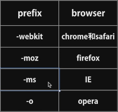
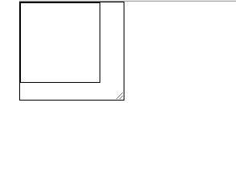

## CSS3

### 前缀



reference manual website: https://css.doyoe.com    -->参考手册网站

Authoritative inquiry website: https://www.caniuse.com     -->权威搜索网站

```css
/*
预处理器pre-processorless/sass cssNext插件
cssNext用来实现一些未来的标准的(未完全在各大浏览器实现的功能)
后处理器post-processor/autoprefixer(插件)
*/
:root{
    --headline-color: #333;
}
@custom-selector: --healine h1, h2, h3, h4;
: --healine{
    color:var(--headline-color)
}
/*
postCss +插件(充分体现扩展性, 200多个)
用js实现的css的抽象的语法树AST(Abstract Syntax Tree)剩下的事留给后人来做了

一般后处理器是配合预处理器使用的
*/
```

- 一般预处理器和后处理器都是互相结合用的, POSTCSS 只是一个工具，postCSS + 插件 实现了什么样的功能，才说明了postCss + 这个插件实现了什么样的功能。


### css3选择器：

E  +  F ——>下一个满足条件的兄弟元素节点

例如：

```html
<div></div>
<p></p>
<p></p>
<p></p>
```

```css
div + p { 
    /* div的下一个是p，p是div的元素兄弟节点，还得是p*/
}
```

E ~ F ——> E 下的所有F元素节点（直接子元素）


##### 并列选择器：

`div[ data ] {  }`——> 所有并列的div中含有data属性的div

`div[data~="a"] ` ——> 选择data属性中只有 单独的a 的

同样对class也是通用的

```html
<div data="a">1</div>
<div data="b">2</div>
<div data="a d">3</div>
<div data="aa">4</div>
```

```css
div[data~="a"]{
	background-color: #f40; 
}
```


```css
div[data|="a"]{  
    /* ——》  选择以单词a开头和以单词a-开头的具有data属性的div */
    background-color: #f40; 
}
```

```html
<div data="a">1</div>
<div data="b-test">2</div>
<div data="a-test">3</div>
<div data="aa">4</div>
```


`div[data^="a"]`——以a开头的都选择

`div[data$="a"]`——以a结尾的都选择

`div[data*="a"]`——以存在a的都选择

```css
input::placeholder{
	/*只能双引号 只能改变input上的placeholder属性的字体颜色*/ 
}
```

```css
div:nth-of-type(1)::selection{
	color: #fff;  /*（白色）*/
	background-color: #fcc;  /*（粉色）*/
	/*text-shadow: 4px 4px #f30;*/
    /* ( 字体阴影 ) */
}
```


选中状态下变颜色

只有3种属性设置

```css
div:not(.test){
	background-color: #f40;
}
```


```css
div:not( [ class ] ){ /*除了class属性的div*/ 
	background-color: #f40;
}
div:not( : last-of-type ){ /*选择除了最后一个div*/ 
	background-color: #f40;
}
: root{
/*根标签——包括html，因为在其他环境里面就不是HTML了*/ 
/*只是在css里面代表html标签*/ 
}
```

```html
<a href="#box1">box1</a>
<a href="#box2">box2</a>
<div id="box1">1</div>
<div id="box2">2</div>
```

利用锚点进行选择

```css
div:target{
	border: 1px solid #f40;
}
```

点击box1


点击box2


- ##### 让高度占满body的技巧

```css
:root,
body{
	margin: 0;
	height: 100%;
}
```


`span:last-child{}`  同下

```css
span:first-chlid{
	/*只要span是别人的儿子，并且是他爹下的所有儿子的第一个*/ 
}
```

比如：

```html
<div>
    <p></p>
    <span>——那么现在span就不是第一个了，是第二个</span>
    <span></span>
    <span></span>
</div>
```

又比如：

```html
<body>
	<span>现在第一个span依然会被选中</span>
    <div>
        <p></p>
        <span></span>
        <span></span>
        <span></span>
    </div>
</body>
```

```css
span:only-child{ 
	/*独生子*/ 
}
```

比如：

```html
<div>
    <p></p>
    <span>这样span就不是独生子，就无法被选中</span>
</div>
```


```css
p:nth-child(2n+1){
	/*
    css是从1开始查数的，n是从0开始的
    （）里面不接受空格，2n+1代表奇数个（odd），2n偶数（even）
    需要考虑其他类型元素的影响
    */ 
}
```

比如：

```html
<div>
    <span>1</span>
    <p>2</p>
    <p>3</p>
    <p>4</p>
    <p>5</p>
</div>
```

```css
p:nth-child(odd){
	background-color: #f60; 
    /*
    因为span不是第一个p所以没选到
	也就是说odd和even是会受到其他元素的影响的
    */
}
```


```css
p:nth-last-child(1){
	/*所有div倒数第一个*/ 
}
```

- 所以以上5个不常用


专指某种类型的第一个儿子，独子（跟上面的有区别，有女儿也没事，只能是有一个儿子），小儿子等等。用法跟上面的雷同。


```css
div:empty{
	/*选中div标签里面是空的（注释也算空，这点跟js有区别，js里算comment节点）*/ 
}
```

`div:checked{/*可以实现一些简单的交互了*/ }`

比如：

```css
div:checked + span{
	/*这个span就是点击后要改变的元素*/ 
}
```


`input:enable{}` ——选中可写入的input框

`input:disable{} `——选中不可写入的input框

```css
input:read-only{
    /*<input type="text" readonly value="只能看不能写">*/ 
    /*——选中不可写入的input框*/
} 

input:read-write{/*可读可写*/}
```


```css
div{
    width: 100px;
    height: 100px;
    left: calc(50% - 50px);
    top: calc(50% - 50px);
	/*这样就可以让这个方块居中了，css3里面的一个很好用的小函数*/ 
	
    /*
    border-radius（半径）: 
    左上	 右上      右下     左下（顺时针）

    左上和右下  	右上和左下

    左上        右上和左下       右下

    border-radius: 10px 20px 30px 40px;
    ||
    border-top-left-radius: 10px;
    border-top-right-radius: 20px;
    border-bottom-right-radius: 30px;
    border-bottom-left-radius: 40px;
    (相对应的顺时针方向)
    ||
    border-top-left-radius: 10px 10px;(水平方向 竖直方向)
    border-top-right-radius: 20px 20px;
    border-bottom-right-radius: 30px 30px;
    border-bottom-left-radius: 40px 40px;
    ||
    拓展写法：
    border-radius: 10px 20px 30px 40px / 10px 20px 30px 40px;

    扇形：
    border-top-left-radius: 100px 100px;(水平方向 竖直方向)
    两个数等于极限宽高的时候（其他方向为0）

    半圆：
    border-top-left-radius: 50px 50px;(水平方向 竖直方向)
    border-top-right-radius: 50px 50px;
    */
}
```


```css
div{
    box-shadow: outset 0px 0px 10px 0px #f40
}
/*
1.inset / outset(默认不写就是外阴影) 

2.0px(水平阴影) 

3.0px(竖直阴影) 

4.3px(模糊度基于边框位置向两边同时模糊) 

5.0px(传播距离/扩大值)

6.#f40(颜色)
*/
```


```css
div{
    width: 100px;
    height: 100px;
	box-shadow: 
        0px 0px 10px #fff,
        inset 0px 0px 10px #fff,
        3px 0px 10px #f0f,
        0px -3px 10px #0ff,
        -3px 0px 10px #00f,
        0px 3px 10px #ff0;
}
```


- 阴影重叠（阴影在背景颜色的上面，文字下面）

  ```css
  div{
  	width: 100px;
  	height: 100px;
  	border: 1px solid #fff;
  	position: absolute;
  	left: calc(50% - 50px);
  	top: calc(50% - 50px);
  	border-radius: 50%;
  	box-shadow: inset 0px 0px 50px #fff,
  				inset 10px 0px 80px #f0f,
  				inset -10px 0px 80px #0ff,
  				inset 10px 0px 280px #f0f,
  				inset -10px 0px 280px #0ff,
  				0px 0px 50px #fff,
  				-10px 0px 50px #f0f,
  				10px 0px 80px #0ff;
  }
  ```

  


阴影动画

```css
i{
	width: 100px;
	height: 100px;
	border: 1px solid #fff;
	position: absolute;
	left: calc(50% - 10px);
	top: calc(50% - 10px);
	border-radius: 5px;
	background: #fff;
	box-shadow: 0px 1px 2px rgba(0, 0, 0, 0.1);
	transition: all .6s;
}
i::after{
	content: "";
	position: absolute;
	left: 0;
	top: 0;
	width: 100%;
	height: 100%;
	border-radius: 5px;
	box-shadow: 0px 5px 15px rgba(0, 0, 0, 0.3); 
	opacity: 0;
	transition: all .6s;
}
i:hover{
	transform: scale(1.25, 1.25);
}
i:hover::after{
	opacity: 1;
}
```


`border-image`:(支持渐变色<线性的>)

`border-image-source: linear-gradient(red, yellow)`


```css
div{
	width: 100px;
	height: 100px;
	border: 10px solid #fff;
	position: absolute;
	left: calc(50% - 50px);
	top: calc(50% - 50px);
	/*支持渐变色*/
	/*border-color: lightblue;*/
	/*一旦用了颜色图片就用不了了*/
	/*下面这俩配套*/
	border-image-source: url(img/4.jpg);
	border-image-slice: 10 20 30 40 fill;
    /*
    	(可以把内容区域也用背景填充，几乎不用);
		（4条切割线上 右 下 左《默认值100%）
		（一般slice值跟宽高一样）
		（可以填百分数， 100效果最好）
    */
	border-image-width: 1;
    /*(默认值1)(如果填auto的话，就会向slice看齐并且加上单位px)*/
	border-image-repeat: stretch;
    /*
    （拉伸效果）
	（只支持填两个参数，水平和竖直）
    stretch:将被分割的图像使用拉伸的方式来填充满边框图像区域。
	repeat:将被分割的图像使用重复平铺的方式来填充满边框图像区域。当图像碰到边界时，如果超过则被截断。
	round:与repeat关键字类似。不同在于，当背景图像不能以整数次平铺时，会根据情況缩放图像。
	space:与repeat关键字类似。不同在于，当背景图像不能以整数次平铺时，会用空白间隙填充在图像周围。
    */
	
	border-image: source slice repeat;
    /*(一般简便写法) */
	border-image-outset: 100px;
    /*(图片往外延伸100px，负值无用)*/
	background-image: url(), url();
    /* ——>使用多张图片，调整background-size，repeat，position让图片呈现 */
}
```


`background-origin: border-box / padding-box / content-box;`

| padding-box | 背景图像相对于内边距框来定位。 | [测试](http://www.w3school.com.cn/tiy/c.asp?f=css_background-origin) |
| ----------- | ------------------------------ | ------------------------------------------------------------ |
| border-box  | 背景图像相对于边框盒来定位。   | [测试](http://www.w3school.com.cn/tiy/c.asp?f=css_background-origin&p=2) |
| content-box | 背景图像相对于内容框来定位。   |                                                              |

只是确定从哪开始，并没有确定从哪结束

-  `border-box`：代表从border到content进行图片排列


- `padding-box`：代表从padding到content排列图片，其余地方用图片填充


- `content-box `：代表从content开始排列图片，其余地方用图片填充


- 其余地方是一部分，content是一部分


- ——这个属性跟background-position相关联

如果border-box， 那么background-position相对border定位图片位置


background-clip:border-box / padding-box / content-box /text

确定从哪结束，用法同上


文字截取图片

```css
div{
	position: absolute;
	left: calc(50% - 200px);
	top: 120px;
	height: 100px;
	line-height: 100px;
	font-size: 100px;
	font-weight: bold;
	width: 500px;
	background-image: url('./img/3.jpg');

	-webkit-background-clip: text;
	/*关键*/

	background-clip: text;
	-webkit-text-fill-color: transparent;
	text-fill-color: transparent;
}
```


background-clip: text;

-webkit-text-fill-color: transparent;

text-fill-color: transparent;

（因为是谷歌私有属性，所以那两个是补充）

这仨出现就是为了-webkit-background-clip: text;的实现


background-image：;

```css
background-attachment: fixed;
	/*
    fixed(背景图片相对于视口定位)
    scroll(相对于设置背景的标签进行定位，标签不动，图片不动)
    local(相对于标签内容定位，内容动，图片动)
	*/
```


```css
background-size：cover;
/*
    cover（覆盖整个标签,以一条边为基准，其他边扩充到填满），
    contain（以一条边为基准。其他边按比例缩放，不会拉伸图片）
*/
```


`background-liner-gradient：（90deg, rgb 10px, rgb 0px, ........）`射线渐变


```css
background-radial-gradient：
(circle / ellipse closest / farthest－corver /
side at top/*(top值可以换成1/2个像素值)*/, rgb 0px.......)
```


```CSS
text－shadow：（x, y, blur/*（模糊度）*/, rgb）
```

可以叠加


```CSS
@font－face{
	font-family：'abc'; /*(对这个下载的字体包命名)*/
	src：url('') format; /*(' 字体解释器 ' )*/
}
```

```css
word-break: break-word;
	/*
	break-word;(尽可能的让英文单词保持完整性)，
	break-all; 到达边界就会换行，没有特例
	*/
```


`columns:`还原报纸格式系列

`column-count: 3;`(文字分为3列)

`column-gap: 20px;`(列与列之间的间隙)

`column-rule: 1px solid black;`(跟border效果类似，列与列之间的分割线) 

制作小说翻页


```css
p::-webkit-selection {
    background:#ccc;
    color:#ff645d; 
}
/*改变文字选中后的颜色*/
```


#### IE6混杂模式盒模型触发条件：

`box-sizing: border-box;`(默认content-box)

css2: `boxWidth = width + padding * 2 + border * 2`

css3:

​	 `boxWidth = width`

​	` contentWidth = width - padding * 2 + border *2`

需求1：移动端横向两个盒子占比例50%；

需求2：input输入框


`overflow: auto;`(当容器内容溢出时，产生滚动条跟scroll类似)

`overflow-x:auto;`(只要一个方向上设置了非默认的属性，那么另一个方向会自动跟着设置)


`resize: none | both | horizontal(X方向) | vertical(Y方向); `

（随着用户拖动使边界变成可调节的，就像视频窗口变换大小一样）

阿里巴巴简历填写界面就用了这个

一定要配合overflow使用

不常用，一般不用，会对布局产生很大影响


##### 针对父级

`display: flex;`——》 弹性盒子，让内容填充满，可伸缩

配合属性：

`flex-derection: row / row-reverse / column / column-reverse;`


`flex-wrap: wrap / nowrap / wrap-reverse;`

定义换行与不换行，还有上面那行跟下面那行倒着换


##### Y方向的flex盒子

`justify-content: flex-start/flex - end/center/space-between/space-around`

`flex-start`: 最左边的元素靠着最左；

`flex - end`: 最右边的元素靠着右边界; 

`center`: 内容居中，两边留出空隙;

`space-between`: 内容区域两边贴边，中间平均分布，相当于内容占满整行;

`space-around`: 相当于给内容里面的每个元素的两边加上了margin值;


##### Y方向的flex盒子

`align-items: stretch / flex-start / flex-end / center / baseline `

`stretch`: 当元素没设置高度时，将会让高度填充满盒子的高度

`flex-start`: 靠上；

`flex-end`: 靠下；

`center`: Y 方向居中

`baseline`: 如弹性盒子元素的行内轴与侧轴为同一条，则该值与'flex-start'等效。其它情况下，

该值将参与基线对齐。（简单来说对齐第一个元素顶部）


单行元素居中

`align-items: center;`

`justify-content: center;`

(如果是多行元素则会保留行间空隙)


多行元素居中：

`align-content: center;`

（除去行间空隙并且居中）


`align-content:  flex-start / flex - end / center / space-between / space-around`

相当于`jusitify-content`，不过是针对Y轴


**针对子集**

**order: 1 / 2 / -1 /.....**

**针对某个元素的排列位置** 


align-self < align-content

操作单个		操作多个


**flex核心**

```
flex-grow: 1 / 2 / 3 / ...... ;
伸：当一行当中还有剩余空间时，内容将会按照所分配的比例来分配
这些空间，直到填满这一行;

flex-shrink: 1;  算法复杂
按照比例算：
    b = 多出来的 width值
    a = 内容区的width值 * flex-shrink值 / (内容区的width值 * flex-shrink值)总和     [占几分之几]
    最后width = a * b（占比 * 多余）
    
flex-basis :
    用来指定伸缩基准值，即在根据伸缩比率计算出剩余空间的分布之前，「flex子项」长度的起始数值。
    在「flex」属性中该值如果被省略则默认为「0%」
    在「flex」属性中该值如果被指定为「auto」，则伸缩基准值的计算值是自身的 <' width '> 设置，如果自身的宽度没有定义，则长度取决于内容。
```


`flex-basis: 100px;` (auto默认值) 

浅层：

​	覆盖width，优先级大于width

深层：

​	没设置`width`时，内容区为英文的时候，会被撑开到英文结束

​	同时设置了`width`和`flex-basis`时，`width`为`flex-basis`的最大宽度

​	也就是说内容区的英文只能被撑开到`width`这么多，而`flex-basis`为最小值

​	无论什么情况， 被不换行内容撑开的容器，不参与压缩


**应用：**

**流式布局：（模拟float布局）**

```html
<div class="wrapper">
	<div class="contain"></div>
</div>
```

```css
.wrapper{
	resize: both;
	overflow: hidden;
	width: 400px;
	height: 800px;
	border: 1px solid black;
	flex-wrap: wrap;
	align-content: flex-start;
}
.contain{
	width: 100px;
	border: 1px solid black;
	height: 100px;
	box-sizing: border-box;
}
```



**圣杯布局：**


比如淘宝，比以前的好用很多


**transition——>过度**

transition: transition-property   transition-duration   transition-timing-function   transition-delay;

 **（同样可以填多个， 用逗号隔开就行了）**

| [transition-property](http://www.w3school.com.cn/cssref/pr_transition-property.asp) | 规定设置过渡效果的 CSS 属性的名称。 |
| ------------------------------------------------------------ | ----------------------------------- |
| [transition-duration](http://www.w3school.com.cn/cssref/pr_transition-duration.asp) | 规定完成过渡效果需要多少秒或毫秒。  |
| [transition-timing-function](http://www.w3school.com.cn/cssref/pr_transition-timing-function.asp) | 规定速度效果的速度曲线。            |
| [transition-delay](http://www.w3school.com.cn/cssref/pr_transition-delay.asp) | 定义过渡效果何时开始。              |

​	**transition-property: all;     /\*可以单独监听width等属性\*/;**

​	**transition-duration: 1s;** 

​	**transition-timing-function: linear /\*运动状态\*/**


**可以用贝塞尔曲线进行调节运动状态;**

​	**transition-delay: 1s /\*延迟多少时间再执行动画\*/;**


**animation(可填多个属性)**

**可以同时执行多种动画，用逗号隔开跟上面的那个一样，运动过程改变颜色也可以**

**用法**如下：构造一个运动名称：

（开头的 0% 可以写为 from，结尾的 100% 可以写成 to）


`animation`: `animate-name` `time` `animation-timing-function` ` time(delay) ` 

   `animation-iteration-count`  `animation-direction  `

   `animation-fill-mode`  `animation-play-state`


**<'** **animation-name** **'>：**检索或设置对象所应用的动画名称

**<'** **animation-duration** **'>：**检索或设置对象动画的持续时间

**<'** **animation-timing-function** **'>：**检索或设置对象动画的过渡类型

**<'** **animation-delay** **'>：**检索或设置对象动画延迟的时间

**<'** **animation-iteration-count** **'>：infinite(无限)** 检索或设置对象动画的循环次数

**<'** **animation-direction** **'>：**检索或设置对象动画在循环中是否反向运动

​		**normal：**正常方向

​		**reverse：**反方向运行

​		**alternate****：**动画先正常运行再反方向运行，并持续交替运行（钟摆运动）

​		**alternate-reverse：**动画先反运行再正方向运行，并持续交替运行

**<'** **animation-fill-mode** **'>：**检索或设置对象动画时间之外的状态

​		**none：**默认值。不设置对象动画之外的状态

​		**forwards：**设置对象状态为动画结束时的状态

​		**backwards：**设置对象状态为动画开始时的状态

​		**both：**设置对象状态为动画结束或开始的状态

**<'** **animation-play-state** **'>：暂停还是运动，因为不兼容。所以几乎不用**

检索或设置对象动画的状态。w3c正考虑是否将该属性移除，因为动画的状态可以通过其它的方式实现，比如重设样式

**animation的steps属性**


**steps（1， end/start）代表没有过度直接跳转**

​		1代表过渡状态一帧跳转，如果是2则分为两帧跳转

​		end: 保留当前帧状态，直到这段动画结束

​		start：保留下一帧状态，直到这段动画结束

**steps（1， end）= step-end**

**steps（1， start）= step-start**


**transfrom: rotate(0deg) —— 里面只能传deg【2d】**

   **rotate3d（1， 1，1 ，0deg）【3d】——括号里控制的是矢量方向**

**360 deg = 1 turn**


**创建3D环境：**

给父级添加属性：

```css
body{
    perspective: 800px; /* 图层与人眼的距离 */
    transform-style: preserve-3d; /* 创建3d图形 */
    perspective-origin: 300px 300px; /* 视觉中心（眼睛位置） */
}
```

子元素

```css
div{
    transfrom-origin: 0 0; /*定义旋转中心*/
    transfrom: rotate3d( 1, 1, 1,90deg );
}
```


**transform：scale()属性[ 可以叠加操作，不会覆盖 ]**

**功能：雁过留声——在某个方向scale后，只有该方向会一直保持scale后的值**


scale：伸缩的是此元素的变化坐标轴刻度

下面的配合可以rotate用

scalex()

scaley()

scalez()

scale3d()


**transform：skew()属性——倾斜坐标轴，并且拉伸刻度以保持（相对的）高不变**

skew(x, y);

skewx();

skewy();


**transform：translate(100px)属性——相对自身**

**transform-origin: 0 0** **0****;(默认0 0为中心)——有第三个值的，很少人知道，可以让视觉处于空间状态**

translate（x, y）;

translatex();

translatey();

translatez();

translate3d(x, y, z);

- #### 在自身宽度不确定的情况下元素居中方法：

  left: 50%;

  transform: translate(-50%);


**perspective: 800px;景深——屏幕离视觉的深度**

**perspective-origin: center center; 默认的center——眼睛所在的位置**

我们所看到的都是 元素在屏幕上的投影


所以人眼的移动是不会影响视觉看到的元素的投影，

但是物体的移动却会改变视觉所看到的投影


**在父级上加perspective = 屏幕上加上一个眼睛，所以存看子集上的每张图片会有不同的拉伸**


**在子集上加perspective = 每个子集上加上一个眼睛，所每个子集的角度无差别（而且只能填在最transform的最前面，否则部分浏览器不识别，而且视觉中心perspective-origin会默认center，并且调节不了）**


**景深可以叠加**


**因为浏览器功能的原因，所以必须要设置transform-style: perserve-3d;**

**才能让这个元素真正保持3D状态，并且直接子集享受此待遇**


而且作为父级设置了**transform-style: perserve-3d;** **perspective: 800px;****的**元素，

必须设置高度，否则自身top会失效，因为子元素对于一个没有高度的父级无法定位


**backface-visibility: visible; 背景可见，hidden——不可见**


**矩阵——就是transform给咱们选中的计算规则**


第一块的列数	=	第二块的行数

结论：想要什么结果就反着推

transform: matirx(-1,0,0,1,0,0)——镜像

x, y, x, y, x, y


像素——红 绿 蓝 ==>空间混色法

点距——同色点之间的距离，描述像素秘籍成度，可以表示像素大小

像素说到底还是一个相对单位

dpi——一英寸所能容纳的像素点数 1英寸=2.54cm

96dpi ≈ 2.54 / 100 = 0.25mm

普通电脑显示屏200dpi ≈ 0.10mm   或者0.15mm

手机ios -- ratino  360dpi  2.54 / 360

通常dpi表示打印机可以高达600dpi

ppi通常表示屏幕


参照像素 96dpi —— css像素——逻辑像素

物理像素——设备像素

设备像素比 dpr = 物理像素 / css像素 

我们也管css编程的逻辑像素方式，叫做逻辑屏幕

比如 ： 360dpi   *   2.5in / 4in = 屏幕宽度/高度

1920 / 2.5in	

1080 / xxx in	这俩求出来的dpi肯定相同


GPU——显卡——处理高精度浮点运算

CPU——内存


```
reflow:
    改变窗口大小改变文字大小
    内容的改变，输入框输入文字
    激活伪类，如:hover
    操作class属性
    脚本操作DOM
    计算offsetWidth和offsetHeight
    设置style属性
```

```
repaint:
	如果只是改变某个元素的背景色、文字颜色、边框颜色，不影响它周围或内部布局的属性repaint
    repaint速度快于reflow
opacity:
transform: translate3d() / translatez();
```


**触发浏览器使用GPU在另一个层面绘制图形**

一般情况下：transform: translateZ(0);就足够了


**专业GPU加速：**

**will-change:transform;**

——兼容性不太好，未来会常用

```css
div{
	width: 100px;
    height: 100px;
}
div: hover{
	will-change: transform;
}
div:active{
	transform: scale(2,3);
}
```


当鼠标移入触发，移出消除，这是最完美的方法，而且要在紧挨着执行之前写，不然浏览器会一直等

浏览器刷新频率1s——60次

平均每16.7毫秒刷新一次页面

gpu可以再一帧里渲染好页面，那么当你改动页面的元素或者实现动画的时候，将会非常流畅

