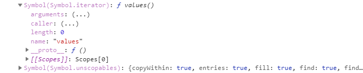

## ES6变化 - Iterator

迭代模式

​		提供一种方式可以按顺序获得聚合对象中的各个元素，是一种最简单也是最常见的设计模式，它可以让用户透过特定的接口巡访集合中的每一个元素而不用了解底层的实现。

迭代器简介：

​		依照与迭代模式的思想而实现，分为内部迭代器和外部迭代器

1）内部迭代器：本身是函数，该函数内部定义好迭代规则，完全接手整个迭代过程，外部只需要一次初始调用。如：`Array.prototype.forEach`、`jQuery.each`

2）外部迭代器：本身是函数，执行返回迭代对象，迭代下一个元素必须显式调用，调用复杂度增加。，但灵活性增强。如：`function outerIterator() {}`

```js
let arr = [1, 3, 2];
function OuterIterator(o) {
    let curIndex = 0;
    let next = () => {
        return {
            value : o[index],
            done : o.length == ++curIndex,
        }
    }
    return {
        next
    }
}
let oIt = OuterIterator(arr);
oIt.next();
```

迭代器的目的：

​		从迭代模式思想中可以看出，就是要标准化迭代操作

例如： 服务器端提供数据给前端，前端for循环遍历，但是由于业务变化，是的数据发生变化，返回对象或者set map，导致前端遍历代码大量重写

解决方案：

​		ES6引入Iterator，部署在nodeList、arguments、Array、Set、Map、字符串上等数据的Symbol.Iterator属性。使的这些数据是iterator可迭代的，能进行for of、...、Array.from等操作

了解Symbol

```js
let oS = Symbol('abc');
let oS1 = Symbol('abc');
console.log(oS); // Symbol(abc); ====> 就是被Symbol包裹的abc
console.log(oS == oS1); // false ====> 具有唯一性
let obj = {
    oS : 'hsz'
}
console.log(obj[oS]); // Symbol(abc) : 'hsz'   取值
console.log(Symbol.Iterator); // Symbol(Symbol.Iterator)
```

如图属于隐藏属性，比如：[]   set   map  arguments   nodeList 都有

自己部署iterator（按照ES6规范）

- iterator实现规则： next、value 、done

- 对象中部署iterator ： 

```js
let obj = {
	0 : 'a',
    1 : 'b',
    2 : 'c',
    length : 3,
    [Symbol.iterator] : function () {
    	let curIndex = 0;
        let next = () => {
            return {
                value : this[index],
                done : this.length == ++curIndex,
            }
        }
        return {
            next
        }
    }
}
// 现在obj就可以被迭代了
```

