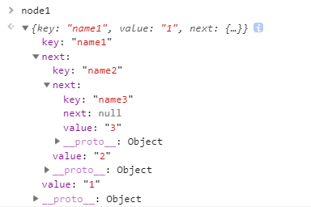

## ES6变化 - Set、Map

Set, Map 和proxy都是兼容性不是很好的，所以也是很少用的

#### ES6变化 - Set

简介：Set是ES6提供给我们的构造函数，能够造出一种新的存储数据的结构

<u>特点：只有属性值，成员值唯一（不重复）</u>

用途：可以转成数组，其本身具备去重，交集，并集，差集的作用等；

```js
let oS = new Set([1, 2, 3, [1, 2], 2]);
console.log(oS); // Set(4) {1, 2, 3, Array(2)}
```

参数：1 必须具有迭代接口：`[], '', arguments, NodeList`

​           2 标识原型上具有 `Symblo(Symbol.iterator): f values()` 属性

Set的增、删、改、查

```js
var oS = new Set([1]);
oS.add(1);
oS.add([1, 2]);
oS.add(true);
console.log(oS);
// Set(3) {1, Array(2), true}
// Array(2) ==> (2) [1, 2] 依然有去重（非常神奇）

// 删
oS.delete(1);

// clear 清空
oS.clear();

// 遍历 
oS.forEach(val => { // 由于Set只有属性值，所以直接遍历val即可
    console.log(val);
})
// 也可以用ES6新增遍历方法 for of循环（具备迭代接口）
for (let prop of oS) {
    console.log(prop);
}
```

Array 与 Set 之间的转换

```js
let arr = [1, 2, 3, 4];
let oS = new Set(arr);

// 方法1 转换为Array  ==> [...]
console.log([...oS]);
// 方法2 Array.from(ES6新规定的数组中应有的静态方法(具备迭代接口))
Array.from(oS);
```

- 回忆我们以前的数组去重

```js
// let arr = [1, 2, 3, 4, 4, 5, 2, 1];
// 有一个小bug 当数组中存在多个相同的对象时。。。
let o = {name : 'hsz'}
let arr = [1, 2, 3, 4, o, 4, 5, o, 2, 1];
let obj = {};
let newArr = [];
for (let i = 0; i < arr.length; i ++) {
    if (!obj[arr[i]]) {
        newArr.push(arr[i]);
        obj[arr[i]] = true;
    }
}
console.log(newArr); // [1, 2, 3, 4, 5] o不见了
/*
因为如下图[{}.toString]内部会调用Object.prototype.toString方法
所以才会出现记忆不准的情况
*/
```


我们来看Set的骚操作

```js
let o = {name : 'hsz'}
let arr = [1, 2, 3, 4, o, 4, 5, o, 2, 1];
let oS = new Set(arr);
```

Set取 并集

```js
// 并集
let arr1 = [1, 2, 3, 4];
let arr2 = [2, 4, 5, 7];
let oS = new Set(...arr1, ...arr2);
```

Set取 交集

```js
// 交集
let arr1 = [1, 2, 3, 4, 2, 3];
let arr2 = [2, 4, 5, 7, 5, 6];
// 先进行数组去重
let oS1 = new Set(arr1);
let oS2 = new Set(arr2);
[...oS1].filter (ele => {oS2.has(ele))
/*
filter()用法说明：
filter 为数组中的每个元素调用一次 callback 函数，并利用所有使得 callback 返回 true 或 等价于 true 的值 的元素创建一个新数组。
callback 只会在已经赋值的索引上被调用，对于那些已经被删除或者从未被赋值的索引不会被调用。那些没有通过 callback 测试的元素会被跳过，不会被包含在新数组中。
　　 callback 被调用时传入三个参数：
	元素的值 （属性值）
    元素的索引 （属性）
    被遍历的数组 （对象本身）
    */
```

Set取 差集

```js
let arr1 = [1, 2, 3, 4, 2, 3];
let arr2 = [2, 4, 5, 7, 5, 6];
let oS1 = new Set(arr1);
let oS2 = new Set(arr2);
let newArr1 = [...oS1].filter(ele => !oS2.has(ele))
let newArr2 = [...oS2].filter(ele => !oS1.has(ele))
console.log([...newArr1, ...newArr2])
```


## ES6 - 变化Map

简介：

Map是ES6提供给我们的构造函数，能够造出一种新的储存数据的结构，本质上是键值对的集合。

特点：

key对应value， key和value唯一，任何值都可当属性。（跟对象很像，有所不同）

用途：

可以让对象当属性，去重等；


```js
let oMap = new Map([['name', 'hsz'], ['age', 18], ['sex', true], [{}, '--']]);
console.log(oMap);
// Map(4) {"name" => "hsz", "age" => 18, "sex" => true, {…} => "--"}
```

map的set（存值）、get（取值）、delete、（删除）

```js
let oMap = new Map();
oMap.set('name', 'hsz');
let obj = {};
oMap.set(obj, '----');
oMap.set({}, '+++');
console.log(oMap) 
// Map(3) {"name" => "hsz", {…} => "----", {…} => "+++"}
// 当我们要取值的时候，如果我们set的对象没有提前储存好的话，那么是取不到的。
oMap.get(obj); // 这样就可以取到想要的对象了
oMap.delete('name');// 删除name属性
oMap.keys(); // 返回属性，可以用来循环遍历
```

map的遍历

```js
oMap.forEach((ele, key, self) => {
	console.log(ele, key, self);
})

for (let val of oMap) {
    console.log(val); // 成对拼成数组
    console.log(val[0], val[1]);
    // val[0]--属性名 val[1]--属性值
}
```


#### 模拟实现map原理

- 实现原理：

  链接链表、hash算法、桶

  链表： `{}{}{}{}{}`

```js
let node3 = {
    key : 'name3',
    value : "3",
    next : null
}
let node2 = {
    key : 'name2',
    value : "2",
    next : node3
}
let node1 = {
    key : 'name1',
    value : "1",
    next : node2
}
```

也就是说我们可以通过`node1.next`依次找到node2，node3，这就是链表如下图：



下面我们来看map内部储存数据大概原理

```js
let oMap = new Map(['name1', '1'], ['name2', '2']);
{key : 'name1', value : '1'}
[{
    next : {
        key : 'name1',
        value : '1',
        next : {
            key : 'name2',
            value : '2'
        }
    }
}, {}, {}, {}, {}, {}, {}, {}];
```

hash算法：

把一些不定的值变成一些特定范围的值

例如：`Math.random() * 10 + 5` 这就是把不定的值变成特定范围的值

要配合桶来用

假如：`[{next:{}}, {}, {}, {}, {}, {}, {}, {}]`这个map里面有8个桶

第一个桶对应对象，第二个桶对应数组，第三个桶对应字符串。。。。

每一个桶都有初始的next方法，并且指向存的值，假如我们有2个数组要储存，hash算法就会帮我们计算这两个数组对应桶的编号是什么，计算好了就会帮我们装进去，装进去的过程又会计算先后顺序通过next连接起来，如同上面的代码块写的那样

下面我们开始实现set、get、delete、has、clear  5个方法

```js
// 1 key对应value
// 2 key和value唯一
// 3 任何值都可当属性。
// 在es6中对象中的属性是可变的
let prop = 'name';
let obj = {
    [prop + 10] : 'hsz'
}
console.log(obj) // {name10: "hsz"}
```

#### [myMap.js地址](./myMap.js)

