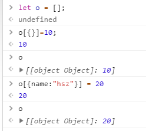

## ES6变化 - Set、Map

Set, Map 和proxy都是兼容性不是很好的，所以也是很少用的

#### ES6变化 - Set

简介：Set是ES6提供给我们的构造函数，能够造出一种新的存储数据的结构

<u>特点：只有属性值，成员值唯一（不重复）</u>

用途：可以转成数组，其本身具备去重，交集，并集，差集的作用等；

```js
let oS = new Set([1, 2, 3, [1, 2], 2]);
console.log(oS); // Set(4) {1, 2, 3, Array(2)}
```

参数：1 必须具有迭代接口：`[], '', arguments, NodeList`

​           2 标识原型上具有 `Symblo(Symbol.iterator): f values()` 属性

Set的增、删、改、查

```js
var oS = new Set([1]);
oS.add(1);
oS.add([1, 2]);
oS.add(true);
console.log(oS);
// Set(3) {1, Array(2), true}
// Array(2) ==> (2) [1, 2] 依然有去重（非常神奇）

// 删
oS.delete(1);

// clear 清空
oS.clear();

// 遍历 
oS.forEach(val => { // 由于Set只有属性值，所以直接遍历val即可
    console.log(val);
})
// 也可以用ES6新增遍历方法 for of循环（具备迭代接口）
for (let prop of oS) {
    console.log(prop);
}
```

Array 与 Set 之间的转换

```js
let arr = [1, 2, 3, 4];
let oS = new Set(arr);

// 方法1 转换为Array  ==> [...]
console.log([...oS]);
// 方法2 Array.from(ES6新规定的数组中应有的静态方法(具备迭代接口))
Array.from(oS);
```

- 回忆我们以前的数组去重

```js
// let arr = [1, 2, 3, 4, 4, 5, 2, 1];
// 有一个小bug 当数组中存在多个相同的对象时。。。
let o = {name : 'hsz'}
let arr = [1, 2, 3, 4, o, 4, 5, o, 2, 1];
let obj = {};
let newArr = [];
for (let i = 0; i < arr.length; i ++) {
    if (!obj[arr[i]]) {
        newArr.push(arr[i]);
        obj[arr[i]] = true;
    }
}
console.log(newArr); // [1, 2, 3, 4, 5] o不见了
/*
因为如下图[{}.toString]内部会调用Object.prototype.toString方法
所以才会出现记忆不准的情况
*/
```



我们来看Set的骚操作

```js
let o = {name : 'hsz'}
let arr = [1, 2, 3, 4, o, 4, 5, o, 2, 1];
let oS = new Set(arr);
```

Set取 并集 交集 差集

