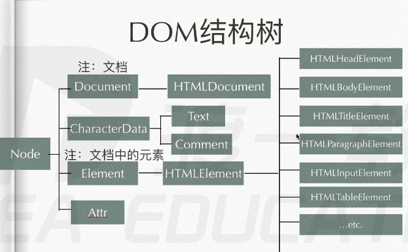

## DOM

#### 什么是DOM？

- DOM ——> Document Object Model

- DOM 定义了表示和修改文档所需的方法，DOM对象即为宿主对象，由浏览器厂商定义，用来操作html和xml功能的一类对象的集合。也有人称DOM是对Html以及xml的标准编程接口。

  XML ——> XHTML ——> html, Xml里面的标签可以自定义

- 操作不了CSS，但是可以通过操作行间样式，间接操作CSS

  ```html
  <div></div>
  <script>
  	var div = document.getElementsByTagName('div')[0];
      div.style.width = '100px';
      div.style.height = '100px';
      div.style.backgrounColor = 'orange';
      var count = 0;
      div.onclick = function () {
          count ++;
          if (count % 2 == 1) {
              this.style.backgrounColor = 'yellow';
          }else {
              this.style.backgrounColor = 'orange';
          }
      }
  </script>
  ```

  

### DOM的基本操作

#### 1) 对节点的改查

- 查看元素节点

  ```js
  document // 代表整个文档
  
  document.getElementById(); // 元素ID在IE8以下的浏览器，不区分ID大小写，而且也返回匹配name属性的元素<div name="div"></div>
  
  document.getElementsByTagName(); // 标签名
  
  document.getElementsByName(); // 需要注意，只有部分标签name可以生效（表单，表单元素，img，iframe）
  
  document.getElementsByClassName(); // 类名，-> IE8和IE8以下的IE版本中没有，可以选中多个class
  
  document.querySlector() // css选择器，IE7和IE7以下的IE版本中没有,选一个
  document.querySlector('div > span.demo');
  
  // 事实上这两个并不使用，因为是静态的，选中一次后，
  // 后面再次选中依然以第一次选中的结果为主，是非实时的，镜像的
  
  document.querySlectorAll() // css选择器，IE7和IE7以下的IE版本中没有
  document.querySlector('div > span.demo');
  ```

  

- 遍历节点树
  
  ```
  parentNode -> 父节点（一个元素只有一个父节点）
  
  childNodes -> 子节点们
  
  firstChild -> 第一个子节点
  
  lastChild -> 最后一个子节点
  
  nextSibling -> 后一个兄弟节点
  
  previousSibling ->前一个兄弟节点
  ```
  
- 基于元素节点树的遍历

  ```
  parentElement -> 返回当前元素的父元素节点（IE不兼容）
  
  children -> 只返回当前元素的子元素节点（兼容性最好，最常用）
  
  node.childElementCount === node.children.length -> 当前元素节点的子节点
  
  firstElementChild -> 返回的是第一个元素节点（IE不兼容）
  
  lastElementChild -> 返回的是最后一个元素节点（IE不兼容）
  
  nextElementSibling / previousElementSibling -> 返回后一个/前一个兄弟元素节点
  ```

- 节点的类型

  ```
  nodeType —> 获取节点的类型， 只读
  
  元素节点 ———— 1
  属性节点 ———— 2
  文本节点 ———— 3
  注释节点 ———— 8
  document ——  9
  DocumentFragment(文本碎片节点) ———— 11 
  ```

- 节点的四个属性

  ```
  nodeName -> 元素的标签名，大写形式表示 ， 只读
  
  nodeValue -> text节点或Comment节点的文本内容 ， 可读可写
  
  nodeType —> 该节点的类型， 只读
  
  attributes -> Element 节点的属性集合
  <div id="demo"></div>
  div.attributes[0].name; // id
  div.attributes.value;  // demo
  value值可读可写，name值只读
  
  节点的一个方法 node.hasChildNodes();返回true/false
  ```

  

```js
HTMLDocument.prototype = {
	__proto__ : Document.prototype
}
// 所以继承关系是：document -->(继承自) HTMLDocument.prototype --> Document.prototype
```

1. `getElementById`方法定义在`Document.prototype`上，即`Element`节点上不能使用。

2. `getElementByName`方法是在`HTMLDocument.prototype`上， 即非`html`中的`document`不能使用（`xml、document、Element`）

3. `getElementByTagName`方法定义在`Document.prototype`和`Element.prototype`上

   ```js
   var div = document.getElemmentsByTagName('div')[0];
   var span = div.getElementsByTagName('span')[0];
   ```

   

4. `HTMLDocument.prototype`定义了一些常用的属性，`body，head`分别指代`HTML`文档中的`<body></body>、<head></head>`标签

   ```js
   document.body; //<body></body>
   document.head; //<head></head>
   ```

   

5. `Document.prototype`上定义了`document、Element`属性，指代文档的根元素，在`HTML`文档中，它总是指代`<html></html>`元素

   ```js
   document.documentElement; // <html><head></head><body></body></html>
   ```

   

6. `getElementsByClassName、querySelector、querySelectorAll`在`Document.prototype、Element.prototype`类中均有定义


#### 练习

```js
// 封装函数，返回元素e的第n层祖先元素节点
function retParent(elem, n) {
    while (elem && n) {
        elem = ele.parentElement;
        n --;
    }
    return elem;
}
```

```js
// 封装函数，返回元素e的第n个元素节点，n为正，
//返回后面的元素节点，n为负，返回前面的，n为0返回自己
function retSibling(e, n) {
    while (e && n) {
        if (n > 0) {
            if (e.nextElementSibling;) {
                e = e.nextElementSibling;
            }else {
                for (e = e.nextSibling; e && e.nodeType ! = 1; e = e.nextSibling)
                // 为了兼容IE9以下
            }  
            n --;
        }else {
            if (e.previousElementSibling) {
                e = e.previousElementSibling;
            }else {
                for (e = e.previousSibling; e && e.nodeType != 1; e = e.previousSibling);
            }
            n ++;
        }
    }
    return e;
}
```

```js
// 编辑函数，封装myChildren功能，解决以前部分浏览器的兼容性问题
Element.prototype.myChildren = function () {
    var child = this.childNodes;
    var len = child.length;
    var arr = [];
    for (var i = 0; i < len; i ++) {
        if (chilid[i].nodeType == 1)
        arr.push(child[i])
    }
    return arr;
}
```

```js
// 封装hasChildren()方法，不可用children属性
Element.prototype.hasChildren = function () {
    var child = this.childNodes;
    var len = child.length;
    var arr = [];
    for (var i = 0; i < len; i ++) {
        if (chilid[i].nodeType == 1)
        return true;
    }
    return false;
}
```

```js
// 封装自己的chlidren函数，用nodeType
function retElementChild(node) {
    var temp = {
        length : 0,
        push : Array.prototype.push,
        splice : Array.prototype.splice;
    },
    child = node.childNodes,
    len = child.length;
    for (var i = 0; i < len; i ++) {
        if (child[i].nodeType === 1) {
            temp.push(child[i]);
        }
    }
    return temp;
} 
```

#### 2） 对节点的增、插、删、替换

- 增

  `document.createElement()` 创建元素节点

  `document.createTextNode()` 创建文本节点

  `document.createComment() ` 创建注释节点

  `document.createDocumentFragment() ` 创建文档碎片节点

- 插

  `ParentNode.appendChild()` parentNode 里面 ，列表的最后插入子节点（剪切操作）

  

  `ParentNode.insertBefore(a, b)` parentNode 里面 ，把 a 插入在 b 之前

  ```js
  // 封装insertAfter函数
  // <div>
  // 	<span></span>
  //  <p></p>
  // <div>
  
  
  Element.prototype.insertAfter = function (targetNode, afterNode) { // <i> <p>
      var beforeNode = afterNode.nextElementSibling;
      if (beofreNode == null) {
          this.appendChild(targetNode)
      }else {
          this.insertBefore(targetNode,beforeNode);
      }
  }
  ```

  

- 删

  `parent.removeChild()` 删除（剪切出来）自己的子节点（参数可以是某个节点）

  `child.remove()` 删除（销毁）自己

- 替换

  `parent.replaceChild(new, origin)`父级调用，拿新的元素替换老的元素


##### Element节点上的一些属性

- `innerHTML` ---->读 / 写html结构，覆盖原有所有内容

  ```js
  div.innerHTML; // 取值操作
  div.innerHTML = '<p></p>'; // 写入操作
  ```

  

- `innerText`(火狐不兼容) / `textContent`（老版本IE不好使） ---> 读 / 写文本内容，覆盖原有所有内容，包括标签结构，所以谨慎使用

##### Element 节点上的一些方法

- `ele.setAttribute();` 设置行间属性

  ```
  <div></div>
  div.setsetAttribute('class', 'demo');
  
  ===> <div class="demo"></div>
  ```

  

- `ele.getAttribute();`获取行间属性，里面填一个参数即可


