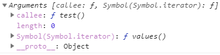

# 剖析this

### this的指向有哪几种情况？

this代表函数调用相关联的对象，通常页称之为执行上下文。

```
1. 作为函数直接调用，非严格模式下，this指向window，全局作用域的this指向window。严格模式下，this指向undefined。

2. 函数预编译过程中，this指向window。

3. 作为某对象的方法调用，this通常指向调用的对象。

4. 使用apply、call、bind 可以绑定this的指向。

5. 在构造函数中，this指向新创建的对象

6. 箭头函数没有单独的this值，this在箭头函数创建时确定，它与声明所在的上下文相同。
```


### 如果对一个函数进行多次 bind，那么上下文会是什么呢？

```js
let a = {}
let fn = function () { console.log(this) }
fn.bind().bind(a)() // => window
```

不管我们给函数 bind 几次，fn 中的 this 永远由第一次 bind 决定，所以结果永远是 window。

```js
// fn.bind().bind(a) 等于
let fn2 = function fn1() {
  return function() {
    return fn.apply()
  }.apply(a)
}
fn2()
```

### 多个this规则出现时，this最终指向哪里？

首先，new 的方式优先级最高，接下来是 bind 这些函数，然后是 obj.foo() 这种调用方式，最后是 foo 这种调用方式，同时，es6中箭头函数的 this 一旦被绑定，就不会再被任何方式所改变。 

### 箭头函数 => 中this

箭头函数不会创建自己的this,**它只会从自己的作用域链的上一层继承this**


```js
var name = "222";
var a = {
    name : "111",
    say : function () {
        console.log(this.name);
    }
}
var fun = a.say;
fun();               // "222" 在全局window上执行
a.say();             // "111"
var b = {
    name : "333",
    say : function (fun) {
        fun(); // 没人调用，走预编译环节，在window执行
        /*
        say : function () {
            console.log(this.name);
        }执行
        */
    }
}
b.say(a.say);        // "222"
b.say = a.say;
b.say();             // "333"
```


### arguments

在"use strict"中这俩家伙不让用

- arguments.callee 

  ```js
  var test = function () {
  	console.log(arguments.callee) // ƒ () {console.log(arguments.callee)}
      // 指向函数自身引用
  }
  
  var num = (function (n) {
      if (n == 1) {
          return 1;
      }
      return n * arguments.callee(n - 1);
  }(5))
  ```

  

- fun.caller( 函数自己的属性 )

  ```js
  // arguments上只有 callee 和length, symbol, __proto__ 
  function test() {
  	demo();
      console.log(arguments); // 如下图
  }
  function demo() {
      console.log(demo.caller);// demo 被调用的那个环境
      /*
      打印结果：
      ƒ test() {
          demo();
          console.log(arguments);
      }
      */
  }
  test();
  ```

  

- 

  ```js
  1.
  var foo = "123";
  function print() {
      var foo = "456";
      this.foo = "789"
      console.log(foo);
  }
  print(); // 456
  
  
  var foo = 123;
  function print() {
      this.foo = 234;
      console.log(foo);
      console.log(this); // print {foo: 234}
  }
  // print(); // 234
  new print(); // 123
  // var this = Object.creat(print.prototype); this里面没有foo属性
  
  
  var a = 5;
  function test() {
      // var this = {
      //   里面没a
      // __proto__ : test.prototype
  	//}
      
      a = 0;
      alert(a);
      alert(this.a);
      var a;
      alert(a);
  }
  test();// 0 5 0
  new test(); // 0 undefined 0
  /*
  AO {
  	a : 0,
  	this : {}
  }
  */
  ```
  
  2.
  
  ```js
  function print() {
      console.log(foo);//undefined
      var foo = 2;
      console.log(foo);//2
      console.log(hello);//报错：hello is not defined
  }
  ```
  
  3.
  
  ```js
  function print() {
      var test; // 被覆盖
      test();
      function test() {
          console.log(1);
      }
  }
  print(); // 1
  ```
  
  4 .
  
  ```js
  function print() {
      var x = 1;
      if (x == "1") {console.log("one")};
      if (x === "2") {console.log("two")};
  }
  print();//one
  ```
  
  5.
  
  ```js
  function print() {
      var marty = {
          name : "marty",
          printName : function () {console.log(this.name)}
      }
      var test1 = {name : "test1"};
      var test2 = {name : "test2"};
      var test3 = {name : "test3"};
      test3.printName = marty.printName;
      var printName2 = marty.printName.bind({name : 123});
      marty.printName.call(test1); // test1
      marty.printName.apply(test2); // test2
      marty.printName(); // marty
      printName2();	// 123
      test3.printName(); // test3
  }
  print();
  ```
  
  6 .
  
  ```
  var bar = {a : "002"};
  function print() {
      bar.a = 'a'; // 覆盖002
      Object.prototype.b = 'b'; 
      return function inner() {
          console.log(bar.a);
          console.log(bar.b);	// 上原型链找
      }
  }
  print()(); // a b
  ```
  
  
  
  


### 克隆

- 浅层

  ```js
  var obj = {
      name : 'abc',
      age : 123,
      sex : 'male'
  }
  var obj1 = {};
  function clone(origin, target) {
      var target = target || {};
      for (var prop in origin) {
          target[prop] = origin[prop]
      }
      return target;
  }
  clone(obj, obj1);
  ```

- 深层(只考虑数组、对象)

  ```js
  var obj = {
  	name : "huang",
  	age : 123,
  	card : ['visa','master',123],
  	wife : {
  		name : "bcd"
          son : {
          name : 'faf'
      }
  	}
  };
  var obj1 = {};
  // 1遍历对象 for (var prop in obj)
  // 2判断是否原始值	typeof() object instanceof toString(万无一失) constructor
  // 3判断是数组还是对象
  // 4建立相应的数组和对象
  // 5递归
  function deepClone(origin, target) {
  	var target = target || {},
  		toStr = Object.prototype.toString,
  		arrStr = "[object Array]"; // "[object Object]" 反正俩个其中一个
      // 1
  	for(var prop in origin){
          // 2
  		if(origin.hasOwnProperty(prop)) {
              
  			if(origin[prop] !== "null" && typeof(origin[prop]) == 'object') {
                  
  				target[prop] = toStr.call(origin[prop]) == arrStr ? [] : {};
  				
                  deepClone(origin[prop],target[prop]); // 如果里面还有引用值，再来
                  // 引用值处理
  			}else{
  				target[prop] = origin[prop]; // 原始值处理
  			}
  		}
  	}
  	return target;
  }
  deepClone(obj, obj1)
  ```

- 三目运算符

  ```js
  var num = 1 > 0 ? ("10" > "9" ? 1 : 0) : 2;
  if (1 > 0) {
      var = num;
      if ("10" > "9") {
          return num = 1
      }else {
          return num = 0
      }
  }else {
      return num = 2
  }
  ```

  