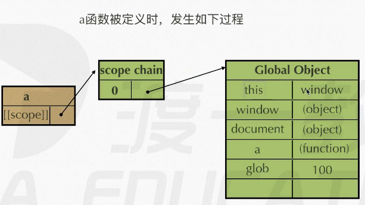
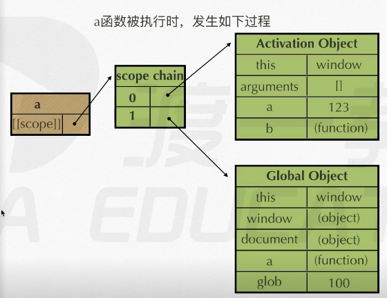
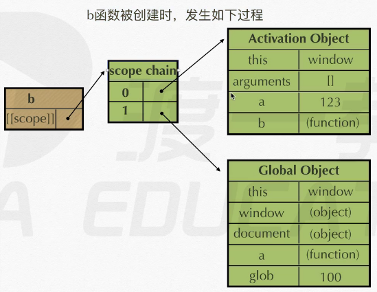
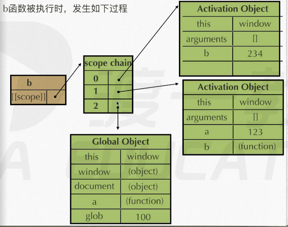

## 函数

### 	函数声明

​        高内聚， 低耦合

- #### 		命名规范：小驼峰式命名

```js
1. 命名函数表达式
function theFirstFun() {
    console.log('abc');
}
theFirstFun.name // theFirstFun
```

​		

- #### 		表达式类函数，忽略函数名, 此时 ***abc*** 被忽略

```js
2. 匿名函数表达式 ———— 后来叫做函数表达式
var test = function abc() {
	console.log('abc')
}
test();
test.name // abc
```

- #### 		函数传参

```js
// 形参
function sum(a, b) {
    console.log(sum.length) // 2 形参长度
    console.log(arguments.length) // 3 实参长度
    // 等同于在函数内部声明了 a, b
	var c = a + b;
	coonsole.log(c)
    // 每个函数在出生的时候系统就会隐式地创建一个arguments（类数组）来装实参——实参列表
}

// 实参
sum(1, 2, 3)

function sum1(a, b, c) {
    // 现在的情况是
    // var a = 1;
    // var b = 2; 
    // var c; 
    // arguments => [1, 2] 实参只有 2 位
    
    // 然后我们改变规则
    a = 10;
    console.log(arguments[0]);  // 10
    
    // 我们再改变一次
    arguments[0] = 20;
    console.log(a); // 20
    
    // 我们会发现这中间存在映射规则 实参的每一位对应形参的每一位
    c = 30;
    console.log(arguments[2]);   // undifined;
    // 所以得出 实参出生的时候有几个 就是几个
}
sum1(1, 2);
```


- #### 		函数的 return 值

  函数的结束条件 + 返回值

```js
function sum(a) {
	console.log(a);
    return '123'; // 有中断 并且 返回值 结束的功能, 不会打印下面的20
    console.log(20);
    // 2
    
}
sum(2);

// 123 倒叙且变中文
function reverse() {
    var num = window.prompt('input');
    var str = "";
    for (var i = num.length - 1; i >= 0; i --) { // 倒着加 2 =》 1 =》 0
        str += transfer(num[i]); 
    }
    console.log(str);
}
function transfer(target) {
    switch (target) {
        case "1":
            return "壹"；
        case "2":
            return "俩"
        case "3":
            return "仨"
    }
}

// 阶乘
// 递归 —— 唯一好处，简洁代码
function jc(n) {
   if (n == 1 || n == 0) {
       return 1;  // 出口， 不然就在无穷死循环 
   }
   return n * jc(n-1)
}

// 1. 找规律
// 2. 找出口
// 斐波那契数列 fn(n) == fb(n - 1) + fb(n -2)
function fb(n) {
    if (n == 1 || n == 2) {
        return 1;
    }
    return fb(n - 1) + fb(n - 2);
}
```


### 作用域初探

#### JS运行分三步：

语法分析（通篇扫描是否有语法错误），预编译（发生在函数执行的前一刻），解释执行（一行行执行）。

​	全局变量：在函数外声明的变量

​	局部变量：在一个区域内声明的变量

#### 预编译

- imply global 暗示全局变量：即任何变量，如果变量未经声明就赋值，此变量归全局所有。

   `a = 123;`

- 一切声明的全局变量，全是window的属性。window就是全局的域

   ```js
   var a = 123;
   console.log(window.a); // 123
   // 等同于：
   window {a : 123}
   ```


- 函数预编译四部曲
  
  
   ```js
   fn(1);
   function fn() {
   console.log(a);		  // ƒ a() {}
   
      var a = 123;		  // 提升到第 2 位 覆盖第一个 a
      console.log(a);       // 123
   
      function a() {};      // 提升到第 1 位
      console.log(a);       // 123
   
      var b = function () {}// 提升到第 2 位
      console.log(b);		  // ƒ () {}
   
      function d() {}		  // 提升到第 1 位
   }
   ```
   
   
   


   1. 创建AO对象 (action object 由于这个函数而产生的存储空间库)

      ```js
      AO {}
      ```

   

   2. 找形参和变量声明，将变量和形参名作为AO的属性名，值为undefined

      ```js
      AO {
      	a: undefined,
      	b: undefined,
      }
      ```

      

   3. 将实参值和形参统一

      ```js
      AO {
      	a: 1,
          b: function () {},
          // 形参没有对应的实参就不用管
      }
      ```

      

   4. 在函数体里面找函数声明， 值赋予函数体 ***（函数表达式提升不了，它是表达式）**

      ```js
      AO {
      	a: function a() {},// 覆盖了形参的a
          b: function () {},
          d: function d() {}
      }
      =====>
      AO {
      	a: 123, // 执行完第一个console.log后，a再度覆盖fn
          b: function () {},
          d: function d() {}
      }
      // 一句一句执行
      ```

      例子2：

      ```js
      function test(a, b) {
      	console.log(a);
          c = 0;
          var c;
          a = 3;
          b = 2;
          console.log(b);
          function b() {}
          function d() {}
          console.log(b);
      }
      test(1);
      /*
      1. AO {}
      2. AO {
      	a: undefined,
      	b: undefined,
      }
      3. AO {
      	a: 1,
      	b: undefined,
      }
      4. AO {
      	a: 1,
      	b: function b() {},
      	d: function d() {}
      }
      所以第一个console.log(a) => 1
      然后继续
      AO {
      	a: 3,
      	b: 2,
      	c: 0,
      	d: function d() {}
      }
      所以后面两个console.log(b) 都是 2
      */
      
      (window.foo || (window.foo = 'bar'));
      // bar
      ```

      全局：global object( GO )

      GO === window


### 作用域，作用域链

#### 函数作用域[[scope]]

   - **[[scope]]** : 每个javascript函数都是一个对象，对象中有的属性可以访问，有的不能，这些属性仅供javascript引擎存取，[[scope]] 就是其中一个。[[scope]] 指的就是函数的作用域，其中存储了执行期上下文的集合。


   - **执行期上下文**： 当函数执行前一刻，会创建一个称为执行期上下文的内部对象（AO）。一个执行期上下文定义了一个函数执行时的环境，函数每次执行时对应的执行期上下文都是独一无二的，所以多次调用一个函数会导致创建多个执行期上下文，当函数执行完毕，它所产生的执行上下文被销毁。

     

#### 作用域链

- `[[scope]]`中所存储的执行期上下文对象的集合，这个集合呈链式链接，我们称这种链式链接为作用域链。查找变量时，要从作用域链的顶部开始查找。Activation Object（AO）到Global Object（GO）。
- 查找变量： 从作用域链的顶端依次向下查找

```js
function a() {
    function b() {
		var bb =234;
    }
    var aa = 123;
    b();
}
var glob = 100;
a();
// a defined(定义) a.[[scope]] --> 0 : GO

// a doing(执行)   a.[[scope]] --> 0 : a-AO
//				   1 : GO

// b defined(定义) b.[[scope]] --> 0 : a-AO
//				   1 : GO

// b doing(执行)   b.[[scope]] --> 0 : b-AO
// 				   1 : a-AO
//				   2 : GO
```










### 闭包1

- 当内部函数被保存到外部时，将会生成闭包。生成闭包后，内部函数依旧可以访问其所在的外部函数的变量。

- 危害：闭包会导致原有作用于连不释放，造成内存泄漏（占的多了，剩的就少了）

  闭包问题的解决方法：立即执行函数、let

  - 详细解释：

    当函数执行时，会创建一个称为**执行期上下文的内部对象（AO）**，执行期上下文定义了一个函数执行时的环境。

    函数还会获得它所在作用域的**作用域链**，是存储函数能够访问的所有执行期上下文对象的集合，即这个函数中能够访问到的东西都是沿着作用域链向上查找直到全局作用域。

    函数每次执行时对应的执行期上下文都是独一无二的，当函数执行完毕，函数都会失去对这个作用域链的引用，JS的垃圾回收机制是采用引用计数策略，如果一块内存不再被引用了那么这块内存就会被释放。

    但是，当闭包存在时，即内部函数保留了对外部变量的引用时，这个作用域链就不会被销毁，此时内部函数依旧可以访问其所在的外部函数的变量，这就是闭包。

```js
function a() {
    function b() {
        var bbb = 234;
        console.log(aaa);
    }
    var aaa = 123;
    return b;
}
var glob = 100;
var demo = a();
demo();        // 123

/*
f b() {} 被保存出来了并且赋给了demo
虽然return后 a 的执行期上下文被销毁，但是b函数[[scope]]=> aAO, bAO, GO
所以顺着链找就可以找到 ‘var aaa = 123;'
*/
```

```js
// 闭包作用于累加
function a() {
    var num = 100;
    function b() {
        num ++;
        console.log(num);
    }
    return b;
}
var demo = a();
demo(); // 101
demo(); // 102
/*
第二个为啥是102 呢？
第一次demo执行完了后，a的AO依然被销毁，但是b的[[scope]]里面存的是第一次demo();后的aAO，事实上就是a斩断了aAO的线，想要销毁，但是b的手里撰着aAO，所以第一次执行产生的aAO，GO被永远当成了基础来用了;
*/
```

```js
// 闭包作用于缓存（储存结构）
function test() {
	var num = 100;
    function a() {
        num ++;
        cosole.log(num);
    }
    function b() {
        num --;
        console.log(num);
    }
    return [a, b];
}
var myArr = test();
myArr[0]();	// 101
myArr[1](); // 100
// 被保存出来的f a() {} 和 f b() {} 共用一个testAO
```


### 立即执行函数

- 函数出生的时候都是等待被执行的，这个过程是很占内存的，尤其是那些只被执行一次就销毁的函数,

- 所以有了立即执行函数，执行完就被销毁，这是跟普通函数的唯一区别，其他一样，有执行期上下文，可以传参等等

- 针对初始化功能的函数

  ```js
  (function () {}()); // W3C 建议第一种
  (function () {})();
  var test = function () {
      console.log(123);
  }();
  + function test() {}();
  - function test() {}();
  ! function test() {}();
  
  // 陷阱
  function test(a, b, c, d) {
      console.log(a, b, c, d)
  }(1, 2, 3, 4);
  // 比报错也不执行
  ```

  

### 闭包2

- 针对for循环

  ````js
  function test() {
      var arr = [];
      for (var i = 0; i < 10; i ++) {
          arr[i] = function () {
              document.write(i + " ");
          }
      }
      return arr;
  }
  var myArr = test();
  for (var j = 0; j < 10; j ++) {
      myArr[j]();
  }
  // 10个10
  /*
  我们只看第一个for循环， 因为第二个只是为了执行
  在for循环中 i 是不停在变的，我们要知道，函数只有在执行的时候才会被读取语句，当return完的时候，test函数才执行结束，而此时所有return出来的函数用的都是 test的AO，并且这个testAO里面for循环出来的i已经变成 10 了，当我们执行 myArr 的时候，用的就是 i = 10
  */
  ````

  **解决办法**

  ```js
  // (es6) let
  function test() {
      var arr = [];
      for (let i = 0; i < 10; i ++) {
          arr[i] = function () {
              document.write(i + " ");
          }
      }
      return arr;
  }
  var myArr = test();
  for (var j = 0; j < 10; j ++) {
      myArr[j]();
  }
  
  ```

  ```js
  function test() {
      var arr = [];
      for (var i = 0; i < 10; i ++) {
          (function (j) {
              arr[j] = function () {
                  document.write(j + " ");
              }
          }(i))
      }
      return arr;
  }
  var myArr = test();
  for (var j = 0; j < 10; j ++) {
      myArr[j]();
  }
  /*
  在for循环中：
  (function (0) {
  	// j = 0
      arr[0] = function () {
          document.write(j + " ");
      }
  }(0)) 
  // ———— 马上执行，然后将arr[0]丢到test的arr里面，等待被return出去,
  // 此时立即执行函数的AO依然被arr[0]这个函数保存在arr[0]的[[scope]]里
  	
  (function (1) {
  	// j = 1
      arr[1] = function () {
          document.write(j + " ");
      }
  }(1)) // ———— 马上执行，然后将arr[1]丢到test的arr里面，等待被return出去
  ........
  ........
  */
  ```

  ```js
  function test () {
      var food = "apple";
      var obj = {
          eatFood : function () {
              if (food != "") {
                  console.log("I am eating " + food);
                  food = "";
              }else {
                  console.log("There is nothing!");
              }
          },
          pushFood: function (myFood) {
              food = myFood
          }
      }
      return obj;
  }
  var person = test();
  person.eatFood(); // I am eating apple
  person.eatFood(); // There is nothing!
  person.pushFood('banana'); 
  person.eatFood(); // I am eating banana
  // 大家保存的都是同一个域，所以公用food这个变量（缓存）
  ```

  

- ```html
  <!-- 阿里巴巴uc事业社招笔试题 -->
  <!--使用原生js，addEventListener，给每个li元素绑定一个click事件，输出他们的顺序-->
  <ul>
      <li>a</li>
      <li>a</li>
      <li>a</li>
      <li>a</li>
  </ul>
  <script>
      window.onload = function () {
          var ulList = document.getElementsByTagName('ul')[0];
          var liList = ulList.getElementsByTagName('li');
          for (var i = 0; i < liList.length; i++) {
              (function (j) {
                  liList[j].addEventListener('click', function (j) {
                      console.log(j)
                  })
              }(i))
          }
      }
      // 同样可以用let解决
  </script>
  ```
```js
  /* 腾讯微店
  写一个方法，求一个字符串的字节长度
  提示： charCodeAt(); 一个中文占两个字节, 一个英文占两个字节, 
  charCodeAt()方法可返回置顶位置的字符得到Unicode编码，这个返回值是0-65535之间的整数
  当返回值是 <= 255时为英文（占1个字节）, 当返回值 > 255 时为中文（占2个字节）
  */ 
  function retByteslen(target) {
      var count,
          len;
      count = len = target.length;
      for (var i = 0; i < len; i++) {
          if (target.charCodeAt(i) > 255) {
              count ++;
          }
      }
      console.log(count);
  }
```

- **逗号表达式**

  ```js
  var a = (1 - 1, 1 + 1, 2 + 5);
  console.log(a); // 7
  // 一定要用括号括起来， 括号里面需要计算的先计算，，最后返回最后一个的计算结果
  
  var f = (function f() {
  			return "1";
  		},function g() {
  			return 2
  		})();
  console.log(typeof(f))  // number
  
  
  
  var x = 1;
  if (function f() {}) {
      // (function f() {}) ==> 被括号变成了表达式，函数名被忽略了
      x += typeof f;
  }
  console.log(x); // "1undefined"
  
  
  // 阿里巴巴UC社招笔试题： body 插入 一个div（原生js）
  var oDiv = document.createElement('div');
  var body = document.getElementsByTagName('body')[0];
  body.appendChild(oDiv);
  ```

  

