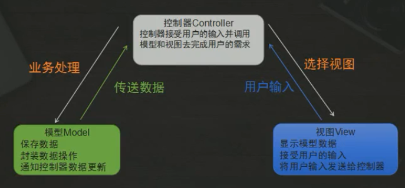

### MVC（模型model 视图view 控制器Controller）

```
model 
模型代表了业务数据和业务逻辑；当数据发生改变时，
它要负责通知控制器调用视图部分；一个模型能为多个
视图提供数据。由于同一个模型可以被多个视图重用，
所以提高了应用的可重用性。
```

```
Controller
它通过View来接受用户的输入，之后利用model来处
理用户的数据，最后结果返回给View。controller
就是view和model之间的一个协调者。
```

```
view
视图向用户显示相关数据，并接受用户的输入数据，
但是它并不进行任何实际的业务处理。
```




### 涉及的H5技术

- 一、Local Storage & Session Storage 键值对储存数据

  ```js
  /*
  Local Storage    没有时间限制的数据储存
  Session Storage  针对一个session的数据库储存（浏览器一关就没了）
  */
  localStorage.firstname = "huang";
  console.log(localStorage.firstname);
  
  Session Storage.lastname = "sz";
  console.log(localStorage.lastname);
  ```

  

- 二、Application Cache 本地缓存应用所需的文件

  ```
  应用程序缓存（Application Cache），用户缓存web应用
  的部分资源，从而达到在没有互联网的情况下也可以进行访问
  ```

  ```html
  <html lang="en" manifest="demo.cache">
  <head>
  	<meta charset="utf-8">
      <title>Document</title>
  </head>
  <body>
  
  </body>
  </html>
  ```

  ```
  manifest : 文件可分为三部分：
  1、cache manifest - 在首次下载后进行缓存
  #2019-5-20 V1.0.0 (注释)————需要更新的话，改变版本号
  /themw.css
  /logo.gif
  /main.js
  
  2、network : - 需要与服务器链接，且不会被缓存
  login.png
  * ————带表所有文件都要联网访问
  
  3、fallback : - 当页面无法访问时回退页面（比如404页面）
  /html5/404.html
  ```

  

- 三、Web SQL 关系数据库

  ```
  openDatatbase : 使用现有数据库或新建数据库来创建数据库对象
  openDatatbase("APP", "1.0", "Not the FT Web App", (5 * 1024 * 1024), function () {});
  参数：
  1、数据库名称
  2、数据库版本号
  3、对数据库的描述
  4、数据库储存大小
  5、回调函数（可选）
  
  transaction : 这个方法允许我们根据情况控制事务提交或回滚
  smallDatabase.transaction(querysql, errCallback, successCallback)
  参数：
  1、包含事务内容的一个方法（querysql中的任何一句sql语句出错，都会回滚）
  2、执行失败的回调函数（可选）
  3、执行成功的回调函数（可选）
  
  executeSql : 用于执行SQL查询
  tx.executeSql(query, data[], innerSuccessCallback, errCallback)
  1、表示查询的字符串，使用的SQL语言是SQLite 3.6.19（可选）
  2、插入到查询中问号所在处的字符串数据。（可选）
  3、成功时执行的回调函数。返回两个参数：tx和执行的结果（可选）
  4、一个失败时执行的回调函数。（可选）
  ```

  

#### 缺点：牵一发而动全身

一旦想要增加一个功能的话，就要更改视图层，功能层，modle层