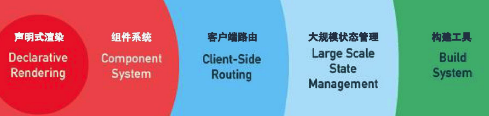

## Vue.js

官方文档：https://vuejs.org/

中文官方文档：https://cn.vuejs.org/

vue是借鉴了Angularjs和reactjs的一些思想和优点的框架

渐进式框架——根据需求来实现功能



### VUE的两大核心

- 响应的数据绑定

  当数据发生改变时，自动更新视图

  利用[Object.definedProperty](https://github.com/z826526354/myProject/blob/master/es6/数据劫持.md)中的getter/setter代理数据

  ```js
  var obj = {};
  obj.a = 1;
  Object.defineProperty(obj, "b", {
      value : 10
      writeable : false
  })
  console.log(obj.b); // 10
  ```

  

- 视图组件

  UI页面映射组件树

  组件可重用，可维护

### 虚拟DOM

- 提供一种方便的工具，是的开发效率得到保证

- 保证最小化的DOM操作，是的执行效率得到保证

  模仿实现 h 函数
  
  ```js
  function vEvement(tagName, prop, children) {
      if (!(this instanceof vEvement)) {
          return new vEvement(tagName, prop, children)
      }
      if (Object.prototype.toString.call(prop) === "[object Array]") {
          children = prop;
          prop = {}
      }
      this.tagName = tagName; // 标签名
      this.children = children; // 子节点
      this.prop = prop; // dom节点的一些属性
      var count = 0; // 记录虚拟DOM节点有多少个
      this.children.forEach( function(child, index) {
          if (child instanceof vEvement) {
              count += child.count;
          }
          count++
      });
      this.count = count;
  }
  vEvement.prototype.render = function () {
      var el = document.createElement(this.tagName);
      var children = this.children;
      var prop = this.prop;
      for (var item in prop) {
          var curProp = prop[item];
          el.setAttribute(item, curProp);
      }
      children.forEach(function (child, index) {
          if (child instanceof vEvement) {
              var childDom = child.render();
          }else {
              var childDom = document.createTextNode(child)
          }
          el.appendChild(childDom);
      })
      return el;
  }
  var dom = vEvement("div",{class: "demo", id: "demo1"}, ["hello world", vEvement("p", {class: "demo2"}, ["我是p标签"])]);
  console.log(dom);
  console.log(dom.render());
  ```


### MVVM模式

M : model 数据模型

V : View 视图模板

vm : View-model视图模型（vue主要实现的地方）

当然vue并不是用了严格的mvvm模式，只是借鉴了它的一些思想


### VUE的运用

- cdn引入

  生产环境

  ```html
  <script src="https://cdn.jsdelivr.net/npm/vue@2.6.10/dist/vue.js"></script>
  ```

  

  开发环境

  ```html
  <script src="https://cdn.jsdelivr.net/npm/vue"></script>
  ```

  

- `npm install vue` NPM下载到本地

#### 基础演示：

```html
<body>
	<div id="demo">
        <!-- 类似微信小程序，进行数据绑定 -->
        {{changeName}}

        <!-- 绑定id -->
        <span v-bind:id="id">{{name}}</span>

        <!-- 动态绑定数据, 控制dom节点的显示和隐藏 -->
        <div :class={demo2:ifClass} v-show="ifShow" v-if="fShow"></div>
        
        <!-- 列表渲染, 循环遍历 -->
        <p v-for="item in message">{{item.title}}</p>
        
        <!-- 点击事件v-on:click，键盘事件(v-on:keyup...) -->
        <button v-on:click="click">点击</button>
    </div>
</body>
<script src="https://cdn.jsdelivr.net/npm/vue@2.6.10/dist/vue.js"></script>
<script>
	var vm = new Vue({
        el : "#demo", // 确定Vue的作用范围——demo
        data : {
        	name : "hsz",
            id : "demo1",
            ifClass : true,
            ifShow : true,
            fShow : false, // 删除整个dom节点了
            // 从性能上考虑的话v-show更加有优势
            // 当然我们不频繁隐藏显示的话v-if会更适合
            message : [{
                title : 18
            }, {
                title : 10
            }]
    	},
        computed : {
            // 计算属性
            changeName : function () {
                return this.name + 123
                // 监听changeName
            }
        },
        methods : {
            // 处理函数的字段
            click : function () {
                console.log(123);
            }
        }
    })

</script>
```

#### input事件

```html
<body>
	<div id="demo">
        <!-- 键盘事件(v-on:keyup...), .enter——回车才触发 -->
        <input :id="id" type="text" v-on:keyup.enter="keyup">click</input>
    </div>
</body>
<script src="https://cdn.jsdelivr.net/npm/vue@2.6.10/dist/vue.js"></script>
<script>
	var vm = new Vue({
        el : "#demo", // 确定Vue的作用范围——demo
        data : {
            id : "demo1",
    	},
        computed : {
            // 计算属性
        },
        methods : {
            // 处理函数的字段
            keyup : function () {
                console.log(123);
            }
        }
    })

</script>
```

#### 双向数据绑定

```html
<body>
	<div id="demo">
        <!-- 表单处理，双向数据绑定 -->
        <input :id="id" type="text" v-model="value" v-on:keyup="keyup">click</input>
    </div>
</body>
<script src="https://cdn.jsdelivr.net/npm/vue@2.6.10/dist/vue.js"></script>
<script>
	var vm = new Vue({
        el : "#demo", // 确定Vue的作用范围——demo
        data : {
            id : "demo1",
            value : 123
    	},
        computed : {
            // 计算属性
        },
        methods : {
            // 处理函数的字段
            keyup : function () {
                console.log(this.value);
            }
        }
    })

</script>
```


#### 生命周期图


### VUE命令

- `vue --version`   查看版本

- `vue init`  快速生成VUE项目

  