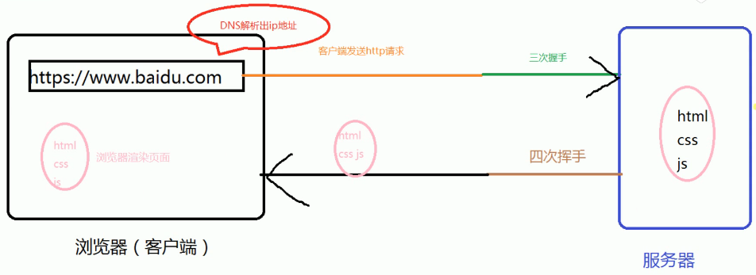
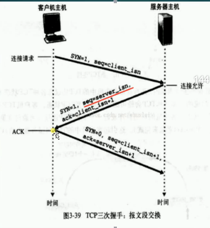
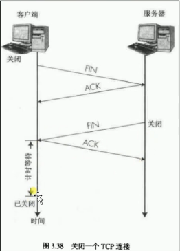
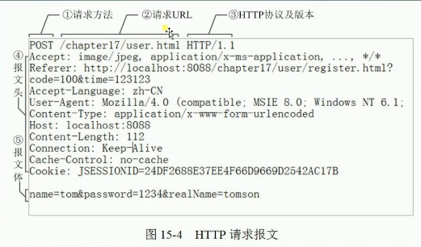
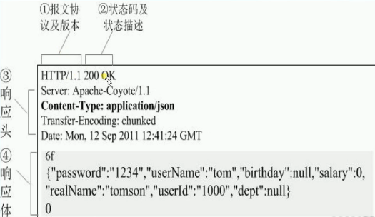

## ajax兼容性写法

- 当我们访问https://www.baidu.com的时候 会经历一个叫 DNS解析的东西，将这个英文地址解析成IP地址（由浏览器即客户端进行解析），然后再由客户端经过三次挥手向服务器发送请求，请求成功后就会将 [html css js] 传递给客户端（这中间又会经过4次挥手，挥手后就会断开，不然链接一直保持会不安全，有可能遭受到其他请求的攻击），然后浏览器就可以把请求的文件渲染到页面

  

- wampserver 可以帮我们创建一个免费的本地服务器

- form表单每上传一次数据就会刷新页面，这对于用户的体验来说是很糟糕的，尤其换成地图是form表单的话，就估计要疯了，而ajajx就应运而生了，可以局部的获取数据而不刷新页面

- Method：GET  POST 等

  Action： address

  enctype： 规定在发送表单数据之前如何对其进行编码application/x-www-from-urlencoded在发送之前编码所有字符（默认），multipart/ from-data(`<input type="file">`)， 不对字符编码。在使用包含文件上传控件的表单时必须使用该值

- 用JavaScript以异步的形式操作XML（现在操作的是 Json）——（Asynchronous JavaScript and XML）

- ajax 请求的过程

  ```js
  1 浏览器
  
  2 ajax对象
  
  3 ajax.open(method, url, true);发送请求的方式、地址、同步还是异步
  
  4 ajax.send(); 发送请求数据
  
  5 onreadystatechange; 监听数据
  
  	onreadystatechange : 状态改变的事件触发器
      
      readyState : 对象状态（integer），状态值
      			0 = 未初始化，未调用send()方法
                  1 = 读取中，已调用send()，正在发送请求
                  2 = 已经读取，send方法执行完成，接收到全部响应内容
  				3 = 交互中，正在解析响应内容
  				4 = 完成，响应内容解析完成
  
  	responseText : 获得字符串形式的响应数据
      responseXML : 获得XML形式的响应数据
      status : 服务器返回的状态码
      		404 = "文件未找到"
  			200 = "成功"
  			500 = "服务器内部"
  			304 = "资源未被修改"
  	statusText : 服务器返回的状态文本信息
  
  6 status == 200
  ```

  #### [ajax的具体例子](./demo1.html)

  

  ### 同源策略

  为了安全而生

  浏览器有一个很重要的概念——同源策略（Same-Origin Policy）。所谓同源是指：<u>**域名、协议、端口**都相同</u>。不同元的客户端脚本（JavaScript、ActionScript）在没明确授权的情况下，不能读写对方的资源。

  简单来说， 浏览器不允许包含在腾讯页面的脚本访问阿里巴巴页面的数据资源，会受到同源策略的限制

  demo：本地访问百度资源

  ```
  https://www.baidu.com:443/
  http://www.w3cschool.com.cn:80/
  协议 : http  https
  域名 : www.baidu.com
  端口 : 443
  
  域名是倒着解析的
  .com    1 顶级域名
  baidu.com  2 二级域名
  zhidao.baidu.comn 3 三级域名
  
  www 二级域名的前缀， 表示万维网维护的
  www.baidu.com 属于特殊的三级域名
  zhidao.baidu.com 属于百度自己维护的网络地址
  
  com org net 属于顶级域名，是在全世界范围内解析的，
  cn hk 是在一个地区解析的，
  如cn 中国
  .com （商业机构）
  .net （从事互联网服务的机构）
  .org （非盈利性组织）
  .com.cn （国内商业机构）
  .net.cn （国内互联网机构）
  .org.cn （国内非盈利性组织）
  实际上大家都喜欢用 .com 来命名
  
  DNS先根据顶级域名判断网络范围，再根据域名查找主机ip地址
  
  理论上www开头相当于占位用的， 在国外一般不写www，为尊重用户习惯才用的www
  没带www的就相当于裸域名，这种裸域名是只可以绑定DNS的a记录，不可以绑定c name记录的
  a记录 : 域名所对应的一个ip地址
  www.baidu.com 可以跟baidu.com 绑定在一起，baidu.com就是www.baidu.com的别名
  对应同一个IP地址
  
  c记录 : 别名（小名）baidu.com 不可以再起小名了
  
  
  端口：
  如果把IP地址比作一间房子，端口就是出入这件房子的门。真正的房子只有几个门，但一个IP地址的端口可以有多个
  浏览网页服务默认的端口号都是80，因此只需要输入网址即可，不用输入":80"
  
  http://www.example.com/
  http://example.com/
  即使是服务器那边配置了别名，指向了同一个IP地址，但是他俩依然不是同一个地址; 依然不同源
  ```

- 三次握手

  ```
  1 线Client端发送链接、请求报文。
  
  2 Server端接受连接后恢复ACK报文，并为这次链接分配资源
  
  3 Client端接受到ACK保温后也向Server端发送ACK报文，并分配资源，这样TCP链接就建立了
  ```

  

- 四次挥手

  ```
  1 Client端发起终端链接请求，也就是发送FIN报文。Server端街道FIN报文后，意思是说"我Client端没有数据要发给你了"，但是如果你还有数据没有发送完成，则不必急着关闭（Socker），可以继续发送数据。
  
  2 Server发送ACK， "告诉Client端，你的请求我收到了，但是我还没准备好，，请继续等我的消息"
  wait : 这个时候Client端就进入FIN_WAIT状态，继续等待Server端的FIN报文
  
  3 当Server端确定数据已经发送完成，则向Client端发送FIN报文，"告诉Client端：好了，我这边数据发送完了，准备好关闭连接了"
  
  4 Client端收到FIN报文后，"就知道可以关闭连接了， 但是他还是不相信网络，怕Server不知道要关闭，所以发送ACK后进入TIME_WAIT状态，如果Server端没有收到ACK则可以重传" ， Server端收到ACK后，"就可以断开连接了"。Client端等待了2MSL后依然没有收到回复，则证明Server端已正常关闭，那好， 我Client端也可以关闭连接了，OK，TCP连接就这样关闭了。
  
  ACK : 响应过程
  FIN : 关闭连接
  ```

  

- TCP/UDP（传输层协议）

  **面向连接的TCP**

  TCP（Transmission Control Protocol，<u>**传输控制协议**</u>）是基于连接的协议，也就是说，在正式接受数据前，必须和对方建立可靠的连接。一个TCP连接必须经过三次"对话"才能建立起来，其中的过程非常复杂，我们这里只做简单、形象的介绍，你只需要能够理解这个过程即可

  

  **面向非连接的UDP协议**

  "面向非链接"就是在正式通信前不必与对方先建立连接，不管对方状态就直接发送，与手机短信非常相似：在发短信的时候，只需要输入对方手机号就可以了。

  UDP（use Data Protocol，<u>**用户数据报协议**</u>）是与TCP相对应的协议。它是**<u>面向非连接</u>**的协议，它不与对方建立连接，而是直接就把数据包发送过去

  容易丢包，而且不安全，主要应用于实时地，语音的

  

- http（请求报文， 响应报文）通过报文进行沟通

  

  ```
  请求报文：
  1 请求头
  	http://tools.jb51.net/table/http_header
  2 请求行
  	请求方法：（GET POST DELETE HEAD TRACE OPTION）
  	请求资源：（url）
  	请求协议版本（HTTP/1.1）
  3 请求主体
  	表单体检数据如：name=hsz&age=23;
  
  响应报文：
  1 响应头
  	http://tool.oschina.net/commons?type=5
  2 响应行
  	响应协议版本号（HTTP/1.1）
  	响应状态码（200）
  	响应状态文字（ok）
  3 响应主体
  	'Sign success'（注册成功）
  ```

  

```
状态码      定义        说明
1xx :      信息        接到请求继续处理
2xx :      成功        成功收到，理解，接受
3xx :      重定向      为了完成请求需要进行另一部措施（如直接从浏览器获取资源，或跳转）
4xx :      客户端错误   请求语法有错误，不能完全符合要求
5xx :      服务器错误   服务器无法完成明显有效的请求

常见http状态码：
成功状态码：
200    服务器成功返回内容
301/2  临时/永久重定向
304    资源未被修改过

失败状态码：
404    请求内容不存在
500    服务器暂时不可用
503    服务器内部错误
```

#### 请求方法GET 和POST的区别

```
在http协议里实际上没有区别！

常规理解：
1 GET 使用 URL或Cookie 传参，而POST将数据放在BODY（请求主体）中。 
比如form表单提交数据   ?name=hsz&age=23

2 GET 的 URL 会有长度上的限制， POST可以传输很多数据（实际上也有限制，并没有很大，只是相对而言）。

3 POST比GET安全
因为POST将数据放在BODY（请求主体）中。GET则放在URL后面，直接暴露出来了
但是打开控制台POST的东西一样可以看到。安全只是相对的
```


### 浏览器的缓存机制

```
304 上次缓存的资源没有改变 —————— 浏览器如何知道是否直接去缓存内容？
请求头：
if-None-Match : 匹配etag 如果它修改了 不取缓存
if-Modified-Since : 将先前服务器端发过来的最后修改时间戳发送回去

响应头：
etag ————> 标记图片资源
last-Modified（服务器最后修改时间）和etag配合使用

ETags和if-None-Match的工作原理是在HTTP Response中添加Etags信息。当客户端再次请求该资源时，将在HTTP Request中加入if-None-Match信息（ETags的值）。如果服务器验证资源的ETags没有改变（该资源没有改变），将返回一个304 状态; 否则将返回200 状态，并返回该资源和新的ETags。


Date : 服务器响应内容日期

Cache-control : 内容缓存时间

*no-cache : 不被缓存的，，只不过每次在想客户端（浏览器）提供响应数据时，缓存都要向服务器评估缓存响应的有效性

*no-store : 用于防止重要的信息被无意地发布。在请求消息中发送将使得请求和响应消息都不使用缓存。根据缓存超时

*max-age : 指示客户机可以接收生存期不大于指定时间（以秒为单位）的响应

max-fresh : 指示客户机可以接收响应时间小于当前时间加上指定时间的响应

max-stale : 指示客户机可以接收超出超时期间的响应消息。如果指定max-stale的值，那么客户机可以接收超出超时期间指定值之内的响应消息

Expires : 内容保质期， 表示存在时间，允许客户端在这个时间之前不去检查（发请求），等同max-age的效果。但是如果同时存在，则cache-control的max-age覆盖

referer : 如果从浏览器地址栏里直接输入地址，请求头没有referer
```

