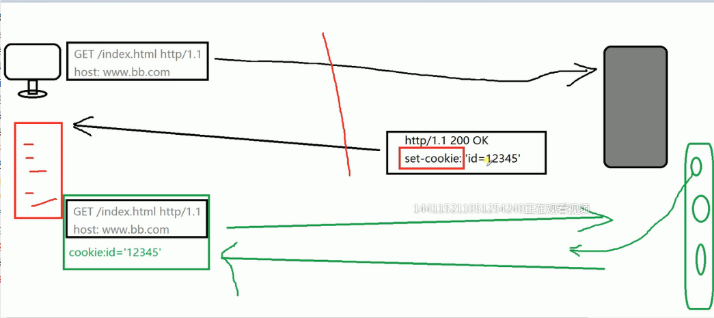
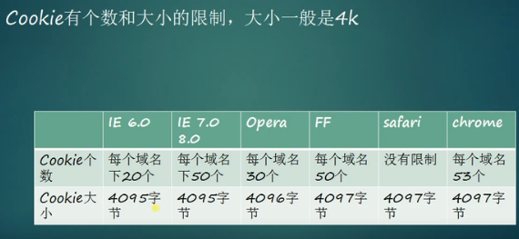
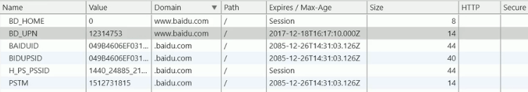

## cookie

### 什么是cookie？

```
Cookie 是由服务器端生成，发送给User-Agent（一般是浏览器），
（服务器告诉浏览器设置一下cookie），浏览器会将cookie以key、
value保存到某个目录下的文本文件内，下次请求同意网站时就发送
该cookie给服务器（前提是浏览器设置为启用cookie）。

cookie就是一个小型文件（浏览器对cookie的内存大小是由限制的————用来记录一些信息）
```

#### - 承载用户信息的http首部存放在请求头里

``` 
form: 邮件发送，以前是放在请求头里面，因为存在一
些服务器专门获取这个信息，用于一些垃圾邮件的发放
导致用户信息泄露，不安全，所以现在不常用了。

user-agent: 监听浏览器的；

referer:标记上一次浏览过的连接
```

#### - IP地址: http上没有可以直接拿到IP地址的首部

```
tcp链接上的另一端上可以轻松获得的IP地址
虽然可以获得但是不好，因为IP地址描述的是机器，不是用户
比如网吧，就是一个机器，多个用户
因特尔服务商在用户登入的时候都会分配一个动态的IP地址
就是说IP地址不稳定是动态的，不是唯一的
浏览器出于安全性考虑，我们浏览过的一些网站会将其进行转换，
转换成一个共享的防火墙模拟的IP地址，而真实的其实已经隐藏了，
所以拿到的可能是一个伪造的IP地址
```

#### - 用户登入，输入密码

```
安全，针对性好，而且方便，会有特定的标识，
这样登入后服务器就会根据这个标识，向用户发送一些用户偏好的网页信息
```

#### -  胖url

```
在你访问一个页面时，动态生成的a标签都会加上一段动态生成的
特殊的字符，当你登入的时候，就会顺带将这段特殊字符传递给服务器，
当你再次登入访问时，服务器就会说 “ 哎~？你上次不是访问过吗？
来，我把你需要的东西传递给你 ” 

缺点：
（1）字段过长，妨碍审美；

（2）无法共享，因为是动态生成的，唯一的，共享了就等于把个人
的资源也共享了，所以不方便；

（3）给服务器增加额外的负载，因为每次传递的东西多了很长的一串.

（4）活动范围只在这个窗口内，等于说窗口关闭了，下一次再
打开时就对接不上了，又会重新生成特殊字符段。
```

#### - cookie

```
1 服务器生成的，让我们设置在浏览器中的信息，设置在本地文件中，
可删可添加，比IP地址稳定

2 当下次请求的时候自动发送，而且不需要用户登入这么麻烦，而且唯一标识是
一直存在的，不会因为窗口关闭就没有了，而且想存在几天就存在几天。
```




```
1 本地有个txt文件专门放cookie值的，所有浏览器的cookie值都在里面。

2 cookie唯一标识是存放在响应头里面（set-cookie），整个过程都是
后台自动的，无需用户特意操作

3 临时cookie: 跟胖url差不多，有日期限制，或者窗口限制，关掉就没有了
（session）
```







```
Domain : 域的意思，当前这个域名下的所有**子域名**都可以获得这个cookie值
path : 设置路径想要两个子域名互相可以访问，只需要设置为"/"即可
Expires : 大概的存储时间（年月日）
max-age : 存储时间，如果不设置，存储周期就在窗口关闭之前这个活动范围内（具体时间）
```

#### cookie的设置

```js
var oDate = new Date();
oDate.setDate(oDate.getDate() + 3);
document.cookie = 'name = hsz;expiress=' + oDate
document.cookie = "age=18;max-age=1000";
/*
1 在IE中可以直接这样设置
2 在chrome中需要打开服务器（需要有http请求才能设置上）
3 在第一个分号后面的都会被浏览器认为是描述value值的信息，所以只能一个个的设置
4 改变value值和path（路径）值可以让同一个name值的cookie同时存在
5 在浏览器中查找cookie值，是从里往外查找的，直到path=/
*/
```

由于cookie没有提供一个特别好的工具库 API来嘿嘿我们调用，所以我们自己写一个

```js
var manageCookie = {
	setCookie : function (name, value, time) {
        document.cookie = name + '=' + value + ';max-age' + time;
        return this;
    },
    removeCookie : function (name) {
        return this.setCookie(name, '', -1);
    },
    getCookie : function (name, callback) {
        var allCookieArr = document.cookie.split('; ');
        console.log(allCookieArr);
        for (var i = 0; i < allCookieArr.length; i ++) {
            var itemCookieArr = allCookieArr[i].split('=');
            console.log(itemCookieArr);
            if (itemCookieArr[0] == name) {
                callback(itemCookieArr[1]);
                return this;
            }
        }
        callback(undefined);
        return this;
    }
}
manageCookie.setCookie('color', 'red', 10000)
	.setCookie('color2', 'green', 10000)
	.removeCookie('color')
	.getCookie('color2', function (data) {
        console.log(data)
    });
```

##### [利用cookie记录移动方块演示](https://z826526354.github.io/myProject/网络/demoCookie.html)

##### [利用cookie记录移动方块代码](./demoCookie.html)

